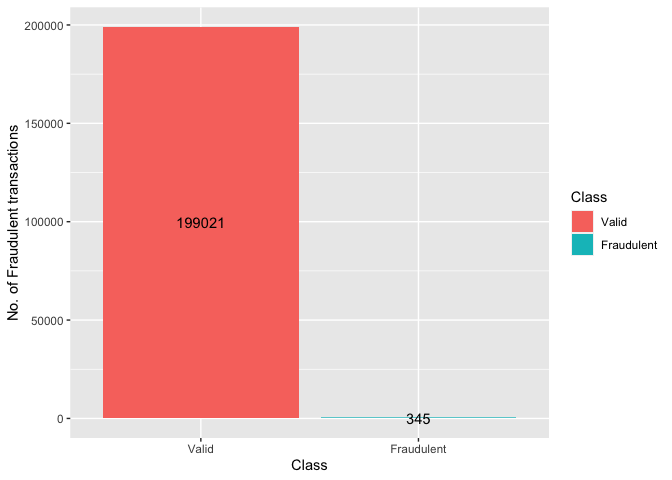
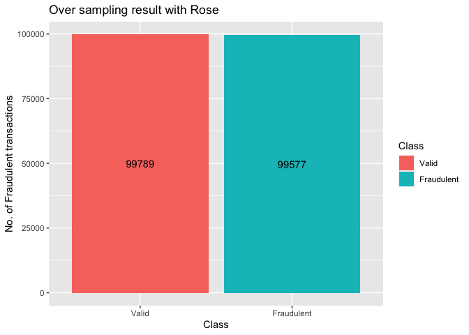
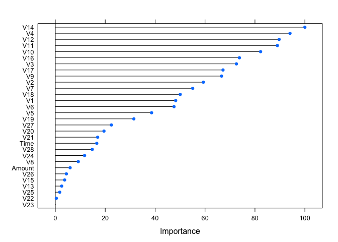
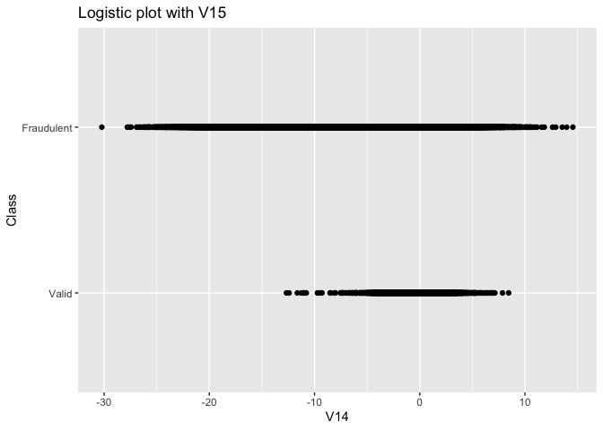
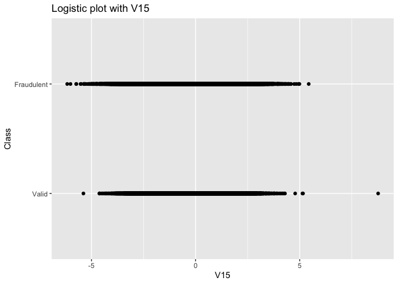
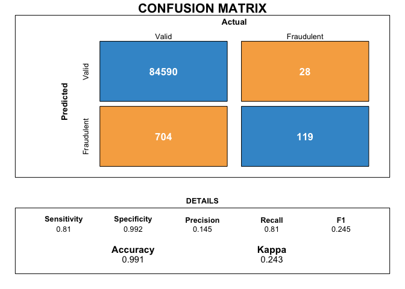

credit card
================

``` r
knitr::opts_chunk$set(echo = TRUE)
library(dplyr)
```

    ## 
    ## Attaching package: 'dplyr'

    ## The following objects are masked from 'package:stats':
    ## 
    ##     filter, lag

    ## The following objects are masked from 'package:base':
    ## 
    ##     intersect, setdiff, setequal, union

``` r
library(NeuralNetTools)
library(caret)
```

    ## Loading required package: lattice

    ## Loading required package: ggplot2

``` r
library(deepnet)
library(rpart.plot)
```

    ## Loading required package: rpart

``` r
library(ROSE)
```

    ## Loaded ROSE 0.0-3

``` r
library(DMwR)
```

    ## Loading required package: grid

    ## Registered S3 method overwritten by 'quantmod':
    ##   method            from
    ##   as.zoo.data.frame zoo

``` r
credit<-read.csv("creditcard.csv")
str(credit)
```

\#\#\#Changing the factors

``` r
credit$Class<-factor(credit$Class,levels = c(0,1),labels=c("Valid","Fraudulent"))
```

### Splitting the data intro training and test

``` r
set.seed(1)
part = createDataPartition(credit$Class, p = 0.7, list=FALSE)
training = credit[part,]
test = credit[-part,]
```

\#\#\#Model on imbalanced training data

``` r
trctrl =trainControl(method = "repeatedcv", number = 10, repeats = 1)
tunegrid=expand.grid(layer1=3,layer2=2,layer3 = 0, hidden_dropout = 0, visible_dropout = 0)
```

``` r
NNModel <- train(Class~.,
                 training,
                 method = "dnn",
                 trControl= trctrl,
                 tuneGrid = tunegrid,
                 preProcess=c("scale","center"))
```

    ## begin to train sae ......

    ## training layer 1 autoencoder ...

    ## training layer 2 autoencoder ...

    ## sae has been trained.

    ## begin to train deep nn ......

    ## deep nn has been trained.

    ## begin to train sae ......

    ## training layer 1 autoencoder ...

    ## training layer 2 autoencoder ...

    ## sae has been trained.

    ## begin to train deep nn ......

    ## deep nn has been trained.

    ## begin to train sae ......

    ## training layer 1 autoencoder ...

    ## training layer 2 autoencoder ...

    ## sae has been trained.

    ## begin to train deep nn ......

    ## deep nn has been trained.

    ## begin to train sae ......

    ## training layer 1 autoencoder ...

    ## training layer 2 autoencoder ...

    ## sae has been trained.

    ## begin to train deep nn ......

    ## deep nn has been trained.

    ## begin to train sae ......

    ## training layer 1 autoencoder ...

    ## training layer 2 autoencoder ...

    ## sae has been trained.

    ## begin to train deep nn ......

    ## deep nn has been trained.

    ## begin to train sae ......

    ## training layer 1 autoencoder ...

    ## training layer 2 autoencoder ...

    ## sae has been trained.

    ## begin to train deep nn ......

    ## deep nn has been trained.

    ## begin to train sae ......

    ## training layer 1 autoencoder ...

    ## training layer 2 autoencoder ...

    ## sae has been trained.

    ## begin to train deep nn ......

    ## deep nn has been trained.

    ## begin to train sae ......

    ## training layer 1 autoencoder ...

    ## training layer 2 autoencoder ...

    ## sae has been trained.

    ## begin to train deep nn ......

    ## deep nn has been trained.

    ## begin to train sae ......

    ## training layer 1 autoencoder ...

    ## training layer 2 autoencoder ...

    ## sae has been trained.

    ## begin to train deep nn ......

    ## deep nn has been trained.

    ## begin to train sae ......

    ## training layer 1 autoencoder ...

    ## training layer 2 autoencoder ...

    ## sae has been trained.

    ## begin to train deep nn ......

    ## deep nn has been trained.

    ## begin to train sae ......

    ## training layer 1 autoencoder ...

    ## training layer 2 autoencoder ...

    ## sae has been trained.

    ## begin to train deep nn ......

    ## deep nn has been trained.

### Confusion matrix with imbalanced training data

``` r
expandedNNPredictions = predict(NNModel,test)
confusionMatrix(test$Class, expandedNNPredictions,positive="Fraudulent")
```

    ## Confusion Matrix and Statistics
    ## 
    ##             Reference
    ## Prediction   Valid Fraudulent
    ##   Valid      85294          0
    ##   Fraudulent   147          0
    ##                                          
    ##                Accuracy : 0.9983         
    ##                  95% CI : (0.998, 0.9985)
    ##     No Information Rate : 1              
    ##     P-Value [Acc > NIR] : 1              
    ##                                          
    ##                   Kappa : 0              
    ##                                          
    ##  Mcnemar's Test P-Value : <2e-16         
    ##                                          
    ##             Sensitivity :      NA        
    ##             Specificity : 0.99828        
    ##          Pos Pred Value :      NA        
    ##          Neg Pred Value :      NA        
    ##              Prevalence : 0.00000        
    ##          Detection Rate : 0.00000        
    ##    Detection Prevalence : 0.00172        
    ##       Balanced Accuracy :      NA        
    ##                                          
    ##        'Positive' Class : Fraudulent     
    ## 

``` r
draw_confusion_matrix <- function(cm) {

  layout(matrix(c(1,1,2)))
  par(mar=c(2,2,2,2))
  plot(c(100, 345), c(300, 450), type = "n", xlab="", ylab="", xaxt='n', yaxt='n')
  title('CONFUSION MATRIX', cex.main=2)

  # create the matrix 
  rect(150, 430, 240, 370, col='#3F97D0')
  text(195, 435, 'Valid', cex=1.2)
  rect(250, 430, 340, 370, col='#F7AD50')
  text(295, 435, 'Fraudulent', cex=1.2)
  text(125, 370, 'Predicted', cex=1.3, srt=90, font=2)
  text(245, 450, 'Actual', cex=1.3, font=2)
  rect(150, 305, 240, 365, col='#F7AD50')
  rect(250, 305, 340, 365, col='#3F97D0')
  text(140, 400, 'Valid', cex=1.2, srt=90)
  text(140, 335, 'Fraudulent', cex=1.2, srt=90)
  
  # add in the cm results 
  res <- as.numeric(cm$table)
  text(195, 400, res[1], cex=1.6, font=2, col='white')
  text(195, 335, res[2], cex=1.6, font=2, col='white')
  text(295, 400, res[3], cex=1.6, font=2, col='white')
  text(295, 335, res[4], cex=1.6, font=2, col='white')

  # add in the specifics 
  plot(c(100, 0), c(100, 0), type = "n", xlab="", ylab="", main = "DETAILS", xaxt='n', yaxt='n')
  text(10, 85, names(cm$byClass[1]), cex=1.2, font=2)
  text(10, 70, round(as.numeric(cm$byClass[1]), 3), cex=1.2)
  text(30, 85, names(cm$byClass[2]), cex=1.2, font=2)
  text(30, 70, round(as.numeric(cm$byClass[2]), 3), cex=1.2)
  text(50, 85, names(cm$byClass[5]), cex=1.2, font=2)
  text(50, 70, round(as.numeric(cm$byClass[5]), 3), cex=1.2)
  text(70, 85, names(cm$byClass[6]), cex=1.2, font=2)
  text(70, 70, round(as.numeric(cm$byClass[6]), 3), cex=1.2)
  text(90, 85, names(cm$byClass[7]), cex=1.2, font=2)
  text(90, 70, round(as.numeric(cm$byClass[7]), 3), cex=1.2)

  # add in the accuracy information 
  text(30, 35, names(cm$overall[1]), cex=1.5, font=2)
  text(30, 20, round(as.numeric(cm$overall[1]), 3), cex=1.4)
  text(70, 35, names(cm$overall[2]), cex=1.5, font=2)
  text(70, 20, round(as.numeric(cm$overall[2]), 3), cex=1.4)
}  
```

``` r
cm_regular<-confusionMatrix(test$Class, expandedNNPredictions,positive="Fraudulent")
draw_confusion_matrix(cm_regular)
```

<!-- -->

The accuracy obtained by the model is extremely high, close to 99.8%.
However, we can see that due to the imbalanced data, we could not
generate a single prediction for fraudulent data. Moreover, our kappa
score is 0, suggesting there is a 100% chance that our predictions are
at random

# Why this is happening: Imbalanced Dataset

``` r
training%>%group_by(Class)%>%tally%>%
  ggplot(aes(Class,n,fill=Class))+
  geom_bar(stat="identity")+
  geom_text(aes(label=n),position=position_stack(vjust=0.5))+
  labs(y="No. of Fraudulent transactions")
```

<!-- -->

### Creating training samples

``` r
rose_train<- ROSE(Class~.,data=training)$data
```

# Balanced Datasets

``` r
rose_train%>%group_by(Class)%>%tally%>%
  ggplot(aes(Class,n,fill=Class))+
  geom_bar(stat="identity")+
  geom_text(aes(label=n),position=position_stack(vjust=0.5))+
  labs(title="Over sampling result with Rose",y="No. of Fraudulent transactions")
```

<!-- -->

# Question 4

\#\#\#Running a logistic regression to test validity of variables

``` r
reg<-glm(Class~.,rose_train,family="binomial")
```

    ## Warning: glm.fit: fitted probabilities numerically 0 or 1 occurred

``` r
summary(reg)
```

    ## 
    ## Call:
    ## glm(formula = Class ~ ., family = "binomial", data = rose_train)
    ## 
    ## Deviance Residuals: 
    ##     Min       1Q   Median       3Q      Max  
    ## -6.2771  -0.4185  -0.0970   0.0347   4.6462  
    ## 
    ## Coefficients:
    ##               Estimate Std. Error  z value Pr(>|z|)    
    ## (Intercept) -2.309e+00  1.918e-02 -120.428  < 2e-16 ***
    ## Time        -1.090e-06  1.633e-07   -6.678 2.42e-11 ***
    ## V1          -5.011e-02  2.606e-03  -19.230  < 2e-16 ***
    ## V2           7.142e-02  3.583e-03   19.935  < 2e-16 ***
    ## V3          -9.249e-02  2.769e-03  -33.398  < 2e-16 ***
    ## V4           4.595e-01  4.519e-03  101.702  < 2e-16 ***
    ## V5           2.215e-02  3.452e-03    6.418 1.38e-10 ***
    ## V6          -1.673e-01  5.584e-03  -29.960  < 2e-16 ***
    ## V7          -4.916e-02  2.827e-03  -17.390  < 2e-16 ***
    ## V8          -6.962e-02  2.606e-03  -26.719  < 2e-16 ***
    ## V9          -1.327e-01  5.702e-03  -23.264  < 2e-16 ***
    ## V10         -1.740e-01  3.915e-03  -44.455  < 2e-16 ***
    ## V11          2.607e-01  5.361e-03   48.632  < 2e-16 ***
    ## V12         -2.184e-01  3.916e-03  -55.763  < 2e-16 ***
    ## V13         -1.877e-01  7.030e-03  -26.695  < 2e-16 ***
    ## V14         -3.755e-01  4.109e-03  -91.379  < 2e-16 ***
    ## V15         -6.490e-02  7.679e-03   -8.452  < 2e-16 ***
    ## V16         -1.312e-01  4.597e-03  -28.534  < 2e-16 ***
    ## V17         -4.132e-02  2.721e-03  -15.182  < 2e-16 ***
    ## V18          4.690e-02  5.612e-03    8.357  < 2e-16 ***
    ## V19         -1.603e-02  7.343e-03   -2.183   0.0291 *  
    ## V20         -5.675e-03  7.867e-03   -0.721   0.4707    
    ## V21          7.649e-02  4.205e-03   18.190  < 2e-16 ***
    ## V22          1.316e-01  8.295e-03   15.864  < 2e-16 ***
    ## V23          5.486e-02  8.718e-03    6.292 3.13e-10 ***
    ## V24         -7.457e-02  1.308e-02   -5.703 1.18e-08 ***
    ## V25          9.413e-03  1.286e-02    0.732   0.4641    
    ## V26         -2.752e-01  1.556e-02  -17.690  < 2e-16 ***
    ## V27          1.498e-01  1.216e-02   12.317  < 2e-16 ***
    ## V28          7.657e-02  1.865e-02    4.106 4.03e-05 ***
    ## Amount       9.221e-04  3.012e-05   30.614  < 2e-16 ***
    ## ---
    ## Signif. codes:  0 '***' 0.001 '**' 0.01 '*' 0.05 '.' 0.1 ' ' 1
    ## 
    ## (Dispersion parameter for binomial family taken to be 1)
    ## 
    ##     Null deviance: 276380  on 199365  degrees of freedom
    ## Residual deviance:  86525  on 199335  degrees of freedom
    ## AIC: 86587
    ## 
    ## Number of Fisher Scoring iterations: 8

We can see that most variables are statistically significant

``` r
trctrl =trainControl(method = "repeatedcv", number = 5, repeats = 1)
```

# Rose train model

``` r
tunegrid=expand.grid(layer1=c(1,2,3),layer2=c(1,2,3),layer3 = c(1,2,3), hidden_dropout = 0, visible_dropout = 0)

rose_Model <- train(Class~.,
                 rose_train,
                 method = "dnn",
                 trControl= trctrl,
                 tuneGrid = tunegrid,
                 preProcess=c("scale","center"))
```

Best model when layer1 =3, layer2 =1, and layer3 = 3

``` r
tunegrid=expand.grid(layer1 = 3,layer2 = 1,layer3 = 3, hidden_dropout = 0, visible_dropout = 0)

final_rose <- train(Class~.,
                 rose_train,
                 method = "dnn",
                 trControl= trctrl,
                 tuneGrid = tunegrid,
                 preProcess=c("scale","center"))
```

    ## begin to train sae ......

    ## training layer 1 autoencoder ...

    ## training layer 2 autoencoder ...

    ## Warning in sae$encoder[[i - 1]]$W[[1]] %*% t(train_x) + sae$encoder[[i - :
    ## longer object length is not a multiple of shorter object length

    ## training layer 3 autoencoder ...

    ## sae has been trained.

    ## begin to train deep nn ......

    ## deep nn has been trained.

    ## begin to train sae ......

    ## training layer 1 autoencoder ...

    ## training layer 2 autoencoder ...

    ## training layer 3 autoencoder ...

    ## sae has been trained.

    ## begin to train deep nn ......

    ## deep nn has been trained.

    ## begin to train sae ......

    ## training layer 1 autoencoder ...

    ## training layer 2 autoencoder ...

    ## Warning in sae$encoder[[i - 1]]$W[[1]] %*% t(train_x) + sae$encoder[[i - :
    ## longer object length is not a multiple of shorter object length

    ## training layer 3 autoencoder ...

    ## sae has been trained.

    ## begin to train deep nn ......

    ## deep nn has been trained.

    ## begin to train sae ......

    ## training layer 1 autoencoder ...

    ## training layer 2 autoencoder ...

    ## Warning in sae$encoder[[i - 1]]$W[[1]] %*% t(train_x) + sae$encoder[[i - :
    ## longer object length is not a multiple of shorter object length

    ## training layer 3 autoencoder ...

    ## sae has been trained.

    ## begin to train deep nn ......

    ## deep nn has been trained.

    ## begin to train sae ......

    ## training layer 1 autoencoder ...

    ## training layer 2 autoencoder ...

    ## Warning in sae$encoder[[i - 1]]$W[[1]] %*% t(train_x) + sae$encoder[[i - :
    ## longer object length is not a multiple of shorter object length

    ## training layer 3 autoencoder ...

    ## sae has been trained.

    ## begin to train deep nn ......

    ## deep nn has been trained.

    ## begin to train sae ......

    ## training layer 1 autoencoder ...

    ## training layer 2 autoencoder ...

    ## Warning in sae$encoder[[i - 1]]$W[[1]] %*% t(train_x) + sae$encoder[[i - :
    ## longer object length is not a multiple of shorter object length

    ## training layer 3 autoencoder ...

    ## sae has been trained.

    ## begin to train deep nn ......

    ## deep nn has been trained.

``` r
final_rose
```

    ## Stacked AutoEncoder Deep Neural Network 
    ## 
    ## 199366 samples
    ##     30 predictor
    ##      2 classes: 'Valid', 'Fraudulent' 
    ## 
    ## Pre-processing: scaled (30), centered (30) 
    ## Resampling: Cross-Validated (5 fold, repeated 1 times) 
    ## Summary of sample sizes: 159493, 159492, 159493, 159493, 159493 
    ## Resampling results:
    ## 
    ##   Accuracy   Kappa    
    ##   0.9612622  0.9225208
    ## 
    ## Tuning parameter 'layer1' was held constant at a value of 3
    ## Tuning
    ##  'hidden_dropout' was held constant at a value of 0
    ## Tuning
    ##  parameter 'visible_dropout' was held constant at a value of 0

We can see that Rose sampling technique provides the best accuracy and
kappa for the data we are using, with accuracy at 97% and kappa at 94%.
This is the best model we have created compared to other sampling
techniques

### Importance plot for Rose model

``` r
Importance = varImp(final_rose)
plot(Importance)
```

<!-- -->

Looking at the importance plot, we can see that V14, V4, V11, and V12
are the most important variables, whereas V23 and V15 are the least
important.

We took the top 2 and the least 2 important variables to see how their
distribution looks like for fraudulent and valid transactions:

## Logistic plot

``` r
rose_train%>%
  ggplot(aes(V14,Class))+
  geom_point()+
  ggtitle("Logistic plot with V15")+
  stat_smooth(method="glm",method.args=list(family="binomial"),col="red")
```

    ## `geom_smooth()` using formula 'y ~ x'

    ## Warning: glm.fit: algorithm did not converge

    ## Warning: Computation failed in `stat_smooth()`:
    ## y values must be 0 <= y <= 1

<!-- -->

``` r
rose_train%>%
  ggplot(aes(V15,Class))+
  geom_point()+
  ggtitle("Logistic plot with V15")+
  stat_smooth(method="glm",method.args=list(family="binomial"),col="red")
```

    ## `geom_smooth()` using formula 'y ~ x'

    ## Warning: glm.fit: algorithm did not converge

    ## Warning: Computation failed in `stat_smooth()`:
    ## y values must be 0 <= y <= 1

<!-- -->

Comparing the distribution for V14 (important variable) with V15 (least
important variable), we can see that fraudulemt does not have a good
dsitribution when classifying fraudulent transactions. However, V14 can
very well classify valid (higher values of V14 correspond with valid
transactions whereas low values do not), whereas V15 has a bad
distribution for valid transactions as well.

From all the sampling techniques, we decide to use Rose model as the
optimum sampling technique to get the best prediction results. This is
because when found the best layer of nodes to use using cross
validation, it provided with the best accuracy, sensitivity,
specificity, and kappa value. Moreover, I removed few least important
variables (Such as V23 and V15) using the importance plot as well as the
logistic plot which showed that they had poor distribution in valid and
fraudulent transactions

## Confusion matrix for Rose model

``` r
RosePredictions = predict(final_rose,test)
confusionMatrix(test$Class, RosePredictions,positive="Fraudulent")
```

    ## Confusion Matrix and Statistics
    ## 
    ##             Reference
    ## Prediction   Valid Fraudulent
    ##   Valid      83905       1389
    ##   Fraudulent    22        125
    ##                                           
    ##                Accuracy : 0.9835          
    ##                  95% CI : (0.9826, 0.9843)
    ##     No Information Rate : 0.9823          
    ##     P-Value [Acc > NIR] : 0.003637        
    ##                                           
    ##                   Kappa : 0.1478          
    ##                                           
    ##  Mcnemar's Test P-Value : < 2.2e-16       
    ##                                           
    ##             Sensitivity : 0.082563        
    ##             Specificity : 0.999738        
    ##          Pos Pred Value : 0.850340        
    ##          Neg Pred Value : 0.983715        
    ##              Prevalence : 0.017720        
    ##          Detection Rate : 0.001463        
    ##    Detection Prevalence : 0.001720        
    ##       Balanced Accuracy : 0.541150        
    ##                                           
    ##        'Positive' Class : Fraudulent      
    ## 

``` r
cm_rose<-confusionMatrix(test$Class, RosePredictions,positive="Fraudulent")
draw_confusion_matrix(cm_rose)
```

<!-- -->

We can see that the rose model predictions are definitely better than
the first prediction we made with the imbalance training data set. It
has an accuracy of 98.9%, with a relatively higher kappa value of 21.6%.
However, that is still quite low. Moreover, while our specificity is
extremely high (99.9%), our sensitivity value is quite low (12.5%). This
means, that while our True Negative rate is quite high, our True
positive rate is quite low. We would ideally like both of them to be
quite high, since while we require our model to correctly predict a
transaction is not fraudulent (so as to not nag customers with
unnecessary blocks), we definitely do want to know when a transaction is
fraudulent to avoid theft.

## Create Loss function

``` r
#Create Predicted Probabilities 
train_data = rose_train %>% select(-Class)
y <- rose_train$Class

predicted_probability = predict(final_rose, newdata = test,type='prob')
default_probability = predicted_probability[,2]

### Loss function
performance = setNames(data.frame(matrix(ncol = 8, nrow = 401)), c("Cutoff","TN", "FN", "TP", "FP", "Sensitivity", "Specificity","Accuracy"))
performance$Cutoff = seq(0.3,0.7,.001)

for (i in 2:400){
  temp = table( default_probability > performance$Cutoff[i], test$Class)
  TP = temp[1,1]
  FP = temp[2,1]
  FN = temp[1,2]
  TN = temp[2,2]
  performance$TN[i] = TN
  performance$TP[i] = TP
  performance$FN[i] = FN
  performance$FP[i] = FP
  performance$Sensitivity[i] = TP/(FN+TP)
  performance$Specificity[i] = TN/(TN+FP)
  performance$Accuracy[i] = (TP+TN)/(FP+FN+TP+TN)
}
```

### Find best cutoff value

``` r
fraud<-rose_train%>%filter(Class=="Fraudulent")
avg_fraud= mean(fraud$Amount)
LossFP = 5
LossFN = 118.03
performance$Loss = performance$FP*LossFP + performance$FN*LossFN


performance[which.min(performance$Loss),"Cutoff"] #Best cutoff
```

    ## [1] 0.699

The best cutoff value we obtained was 0.699

### Confusion matrixn with loss function predictions

``` r
delta = 0.699
predicted_fraud = ifelse(default_probability >= delta,"Fraudulent","Valid") #Class prediction
predicted_fraud <- as.factor(predicted_fraud)
confusionMatrix(predicted_fraud,test$Class, positive="Fraudulent") #Create confusion matrix
```

    ## Warning in confusionMatrix.default(predicted_fraud, test$Class, positive
    ## = "Fraudulent"): Levels are not in the same order for reference and data.
    ## Refactoring data to match.

    ## Confusion Matrix and Statistics
    ## 
    ##             Reference
    ## Prediction   Valid Fraudulent
    ##   Valid      84590         28
    ##   Fraudulent   704        119
    ##                                          
    ##                Accuracy : 0.9914         
    ##                  95% CI : (0.9908, 0.992)
    ##     No Information Rate : 0.9983         
    ##     P-Value [Acc > NIR] : 1              
    ##                                          
    ##                   Kappa : 0.2432         
    ##                                          
    ##  Mcnemar's Test P-Value : <2e-16         
    ##                                          
    ##             Sensitivity : 0.809524       
    ##             Specificity : 0.991746       
    ##          Pos Pred Value : 0.144593       
    ##          Neg Pred Value : 0.999669       
    ##              Prevalence : 0.001720       
    ##          Detection Rate : 0.001393       
    ##    Detection Prevalence : 0.009632       
    ##       Balanced Accuracy : 0.900635       
    ##                                          
    ##        'Positive' Class : Fraudulent     
    ## 

``` r
cm_final<-confusionMatrix(predicted_fraud,test$Class,positive="Fraudulent")
```

    ## Warning in confusionMatrix.default(predicted_fraud, test$Class, positive
    ## = "Fraudulent"): Levels are not in the same order for reference and data.
    ## Refactoring data to match.

``` r
draw_confusion_matrix(cm_final)
```

<!-- -->

The model using the Loss function significantly improved our model. For
starters, the kappa value has increased from 18% to 66.4%, which means
there is lesser chance that our prediction is at random. While this is
still not the best odds, obtaining an extremely high kappa value is
quite rare, and the value we obtained is quite decent in retrospect. Our
accuracy, like our previous model, is still extremely high at 99.9%.

The specificity value, just like the previous prediction, has a high
sensitivity value of 99.9%. This means that when it is not a fraudulent
transaction, the model is able to predict that it is not a fraudulent
transaction 99.9% of the times.

On the other hand, our sensitivity value increased tremendously (From
10% to 82%). This means that when a transaction is fraudulent, the model
is able to predict it is fraudulent 82% of the times.

\#\#a)

According to our confusion matrix, 124 transactions we correctly
detected as fraudulent, out of 85441. Hence, per one million
transactions, we detect and stop:

(124/85441)\*1000000 = 1462

\#\#b)

23 transactions we thought were valid but were actually fraudulent, so
we could not stop them. If 20 million transaction a year, then 1.6
million transactions per month. Thus, the total number of undetected
transactions per month would be:

(23/85441)\*1600000 = 429 fraudulent transactions per month

An average fraudlemnt amount is 118, thus the total amount of money we
lose on undetected fraudulent transactions is:

429\*118 = 50622

\#\#c)

The transactions that were unnecessarily put on hold were the
transactions we predicted were fraud but were actually valid, which is
525. Thus, per one million, the total number of such instances are:

(525/85441)\*1000000 = 6144

\#\#d)

As stated earlier, our kappa value is 0.31, which means there is a 69%
chance that our predictions are at random. Hence, there is a good amount
of uncertainty in our answers to the questions. However, obtaining an
extremely high kappa value is a rarity in the real world, and I would
say that a kappa value of 0.31 is not significantly bad.
