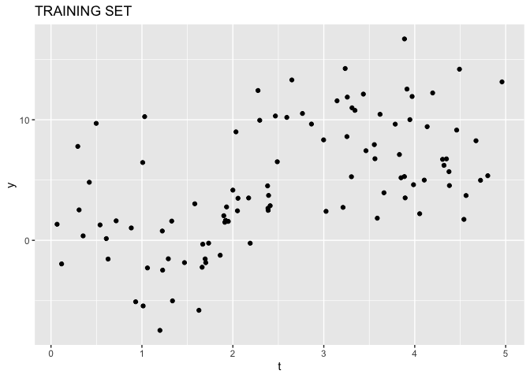
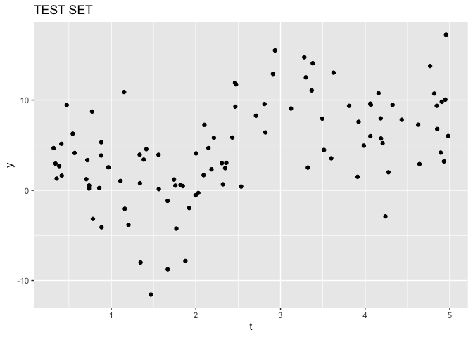
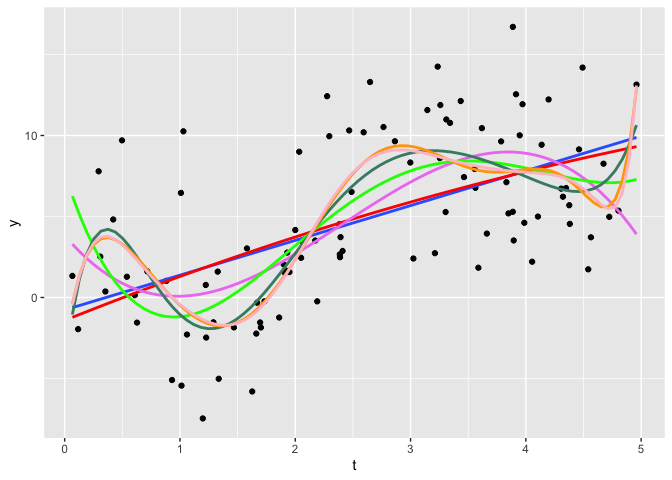
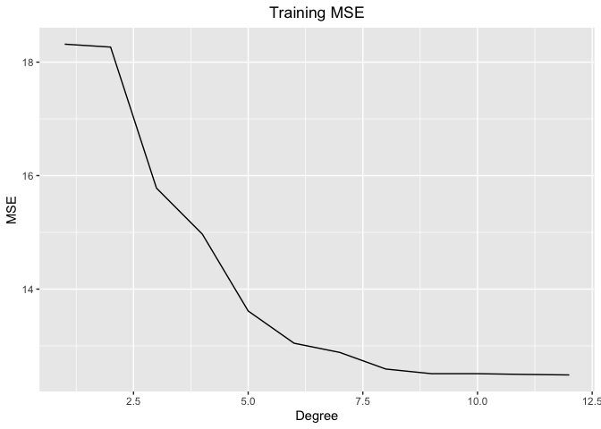
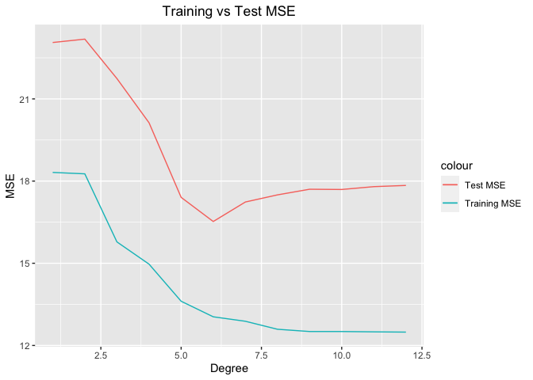
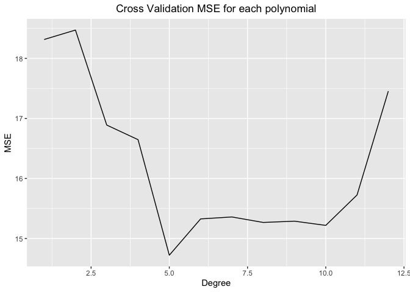
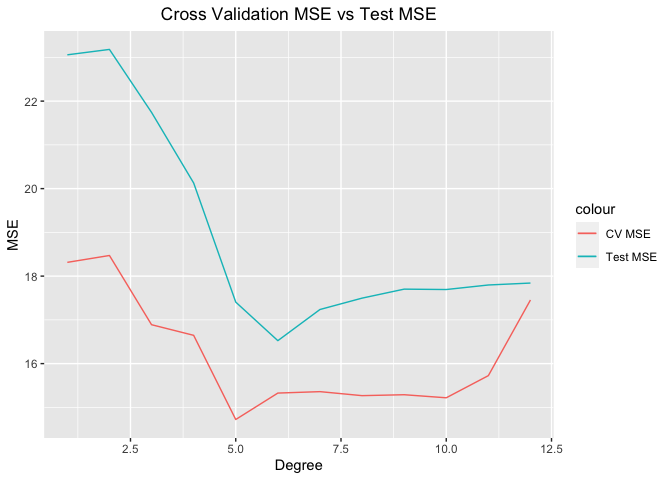
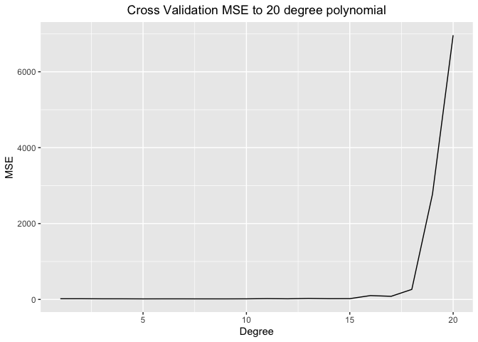
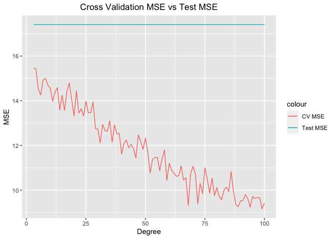

Cross-validation
================
Danish Siddiquie
02/31/2019

``` r
set.seed(1)
n=100
t=runif(n,0,5)
y=2*t + 3*cos(2*t) + rnorm(n,0,4)

train<-data.frame(t,y)

t=runif(n,0,5)
y=2*t + 3*cos(2*t) + rnorm(n,0,4)

test<-data.frame(t,y)
```

## Training and Test set simulated data on a plot

``` r
ggplot()+geom_point(data=train, aes(t, y))+ggtitle("TRAINING SET")
```

<!-- -->

``` r
ggplot()+geom_point(data=test, aes(t, y))+ggtitle("TEST SET")
```

<!-- -->

## Line plot for different polynomial degrees on the training set

``` r
ggplot(data=train,aes(t,y))+
  geom_point()+
  geom_smooth(method="lm",se=F)+
  geom_smooth(method="lm",se=F,formula=y~poly(x,2),color="red",show.legend=T)+
  geom_smooth(method="lm",se=F,formula=y~poly(x,3),color="violet")+
  geom_smooth(method="lm",se=F,formula=y~poly(x,4),color="green")+
  geom_smooth(method="lm",se=F,formula=y~poly(x,7),color="aquamarine4")+
  geom_smooth(method="lm",se=F,formula=y~poly(x,9),color="orange")+
  geom_smooth(method="lm",se=F,formula=y~poly(x,12),color="pink")
```

    ## `geom_smooth()` using formula 'y ~ x'

<!-- -->

## Fitting 1 to 12 degree polynomials on training set

``` r
#lapply

#lapply(1:12,function(x)=lm(y~poly(t,x),train))

#

first<-lm(y~poly(train$t,1))
train_MSE1 = mean(first$residuals^2)
second<-lm(y~poly(train$t,2))
train_MSE2 = mean(second$residuals^2)
third<-lm(y~poly(train$t,3))
train_MSE3 = mean(third$residuals^2)
fourth<-lm(y~poly(train$t,4))
train_MSE4 = mean(fourth$residuals^2)
fifth<-lm(y~poly(train$t,5))
train_MSE5 = mean(fifth$residuals^2)
sixth<-lm(y~poly(train$t,6))
train_MSE6 = mean(sixth$residuals^2)
seventh<-lm(y~poly(train$t,7))
train_MSE7 = mean(seventh$residuals^2)
eigth<-lm(y~poly(train$t,8))
train_MSE8 = mean(eigth$residuals^2)
ninth<-lm(y~poly(train$t,9))
train_MSE9 = mean(ninth$residuals^2)
tenth<-lm(y~poly(train$t,10))
train_MSE10 = mean(tenth$residuals^2)
eleventh<-lm(y~poly(train$t,11))
train_MSE11 = mean(eleventh$residuals^2)
twelvth<-lm(y~poly(train$t,12))
train_MSE12 = mean(twelvth$residuals^2)

train_error <- numeric(12)
for(i in 1:12){
   model1 <- lm(formula=y~poly(t,i), data = train)
   predictMSE<-predict(model1,train)
  train_error[i] <- mean((train$y-predictMSE)^2)
}
```

## Training MSE plot

``` r
degree<-c(1:12)
MSE<-c(train_MSE1,train_MSE2,train_MSE3,train_MSE4,train_MSE5,train_MSE6,
                         train_MSE7,train_MSE8,train_MSE9,train_MSE10,train_MSE11,train_MSE12)
training_MSE<-data.frame(degree,train_error)

ggplot(training_MSE,aes(degree,train_error))+
  geom_line()+
  labs(title="Training MSE",x="Degree",y="MSE")+
  theme(plot.title = element_text(hjust=0.5))
```

<!-- -->

Looking at the Training MSE plot, I would choose the 10th degree
polynomial for prediction, as it provides the least amount of MSE. Even
though 11 and 12 also provide relatively same amount of MSE, we choose
the model which uses the least amount of degrees possible to be more
simplistic

In pratice creating a model with 12 degree polynomial to predict the
data is overfitting the data, since increasing degrees of polynomial
increases the sensitivity to specific training data, thereby increasing
MSE. Hence, while the training data shows a continuous decrease in MSE,
the test set may not.

Theoretically, the lowest MSE can be the epsilon variance, which in our
case is 16, which we derive from the equation y(t) = 2t + 3cos(2t) + C,
where C \~ N(0,16). However, we are getting the lowest MSE using the
10th degree polynomial to fit the data, which is giving an MSE of around
26, which is pretty high relative to the lowest theoretical MSE.

``` r
test_error1 <- numeric(12)
for(i in 1:12){
   model1 <- lm(formula=y~poly(t,i), data = train)
   predictMSE<-predict(model1,test)
  test_error1[i] <- mean((test$y-predictMSE)^2)
}


test_error1DF<-data.frame(degree,test_error1)

ggplot() + 
  geom_line(aes(x=degree,y=training_MSE$train_error,col="Training MSE"))+
  geom_line(aes(x=degree,y=test_error1DF$test_error1,col="Test MSE"))+
  labs(title="Training vs Test MSE",x="Degree",y="MSE")+
  theme(plot.title = element_text(hjust=0.5))
```

<!-- -->

The training MSE does not predict the test MSE very well. While the
training model recommended the 10th degree polynomial to be used for
predicted, the test MSE shows that the 6th degree polynomial has the
lowest MSE. Moreover, the test MSE is quite lower than the training MSE,
especially at the 6th degree polynomial, where there the test MSE is
extremely low before going back up

``` r
lm_model= train(y~t, train, method="lm")
lm_model$results
```

    ##   intercept     RMSE  Rsquared      MAE    RMSESD RsquaredSD     MAESD
    ## 1      TRUE 4.469492 0.3079539 3.726547 0.3050375 0.08491411 0.3361938

``` r
regressControl1 = trainControl(method="cv",number = 10)

lm_model_cv = train(y~t, train, method="lm", trControl = regressControl1)
lm_model_cv$results
```

    ##   intercept     RMSE  Rsquared      MAE    RMSESD RsquaredSD     MAESD
    ## 1      TRUE 4.335895 0.3486031 3.562376 0.6056571  0.2361184 0.4406712

We can see that the MSE from the CV linear regression model is slightly
lesser than the MSE from the simple linear regression model (\~0.35
less). They are different because the 10-fold cross validation method is
splitting the data into k equal sized groups, training the model on all
of them, estimating the Test MSE on each group and then averaging it out
from the 10 groups. Since the k-fold CV method trains the model multiple
times and makes a lot more repititions, we trust the cv method more.

``` r
regressControl = trainControl(method="repeatedcv",number = 10, repeats = 5)

cverror <- numeric(12)
for(i in 1:12){
  f <- bquote(y ~ poly(t, .(i)))
   models <- train(as.formula(f), data = train, trControl=regressControl, method='lm')
  cverror[i] <- (models$results$RMSE)^2
}

cverror
```

    ##  [1] 18.31460 18.47150 16.88965 16.64672 14.72237 15.32670 15.35936 15.26783
    ##  [9] 15.28904 15.21887 15.72527 17.45423

``` r
cv_errorDF<-data.frame(degree,cverror)

ggplot(cv_errorDF,aes(degree,cverror))+
  geom_line()+
  labs(title="Cross Validation MSE for each polynomial",x="Degree",y="MSE")+
  theme(plot.title = element_text(hjust=0.5))
```

<!-- -->

Based on the minimum MSE criteria, the 5th degree polynomial best
predicts new data

``` r
test_error <- numeric(12)
for(i in 1:12){
  f <- bquote(y ~ poly(t, .(i)))
   models <- train(as.formula(f), data = train, trControl=regressControl, method='lm')
   predictMSE<-predict(models,test)
  test_error[i] <- mean((test$y-predictMSE)^2)
}


test_errorDF<-data.frame(degree,test_error)

ggplot()+
  geom_line(aes(cv_errorDF$degree,cv_errorDF$cverror,col="CV MSE"))+
  geom_line(aes(test_errorDF$degree,test_errorDF$test_error,col="Test MSE"))+
  labs(title="Cross Validation MSE vs Test MSE",x="Degree",y="MSE")+
  theme(plot.title = element_text(hjust=0.5))
```

<!-- -->

The cross validation MSE predicts the Test MSE quite well. It has the
same trend, and also is approximately showing the least MSE at the same
degree polylinomial (5 for test MSE comapred to 6 for CV MSE).

It is because the test MSE using the simple linear regression model from
5) still picks out the best fit for the model, exactly what the Cross
Validation model is doing. The only difference between the two is that
the Cross Validation model is more robust as it undergoes more
repitions, thus providing higher confidence in our prediction.
Nevertheless, the prediction of the test MSE still picks out the best
MSE trendline from both regression models. The validation test is more
of how best the training model can predict the test data.

``` r
cverror <- numeric(20)
for(i in 1:20){
  f <- bquote(y ~ poly(t, .(i)))
   models <- train(as.formula(f), data = train, trControl=regressControl, method='lm')
  cverror[i] <- (models$results$RMSE)^2
}

degree20<-c(1:20)
cv_errorDF<-data.frame(degree20,cverror)
ggplot(cv_errorDF,aes(degree20,cverror))+
  geom_line()+
  labs(title="Cross Validation MSE to 20 degree polynomial",x="Degree",y="MSE")+
  theme(plot.title = element_text(hjust=0.5))
```

<!-- -->

``` r
cverror
```

    ##  [1]   18.36072   18.69343   16.67168   16.41002   14.65524   15.37812
    ##  [7]   15.37924   14.71747   14.64847   16.07445   21.95758   17.30381
    ## [13]   27.02142   20.13751   21.29946  102.43291   82.82605  264.70168
    ## [19] 2775.20061 6963.45457

We run all the models with different polynomial degrees on the cross
validation set. What we will observe is that when the degree of the
polynomial is low then the error will be high. This error will decrease
as the degree of the polynomial increases as we will tend to get a
better fit. However the error will again increase as higher degree
polynomials that overfit the training set will be a poor fit for the
cross validation set. When we are doing cross validation, the
algorithm’s sensitivity to specific training data increases
significantly, thus the big jump when we test with very high polynomial
degrees.

``` r
kerror <- numeric(98)
testMSE<-numeric(98)
for(i in 3:100){
  f <- bquote(y ~ poly(t,5))
  models <- train(as.formula(f), data = train, trControl=trainControl(method="cv",number = i),
  method='lm')
  kerror[i] <- (models$results$RMSE)^2
  predictMSE1<-predict(models,test)
  testMSE[i] <- mean((test$y-predictMSE1)^2)
}
```

    ## Warning in nominalTrainWorkflow(x = x, y = y, wts = weights, info = trainInfo, :
    ## There were missing values in resampled performance measures.
    
    ## Warning in nominalTrainWorkflow(x = x, y = y, wts = weights, info = trainInfo, :
    ## There were missing values in resampled performance measures.
    
    ## Warning in nominalTrainWorkflow(x = x, y = y, wts = weights, info = trainInfo, :
    ## There were missing values in resampled performance measures.
    
    ## Warning in nominalTrainWorkflow(x = x, y = y, wts = weights, info = trainInfo, :
    ## There were missing values in resampled performance measures.
    
    ## Warning in nominalTrainWorkflow(x = x, y = y, wts = weights, info = trainInfo, :
    ## There were missing values in resampled performance measures.
    
    ## Warning in nominalTrainWorkflow(x = x, y = y, wts = weights, info = trainInfo, :
    ## There were missing values in resampled performance measures.
    
    ## Warning in nominalTrainWorkflow(x = x, y = y, wts = weights, info = trainInfo, :
    ## There were missing values in resampled performance measures.
    
    ## Warning in nominalTrainWorkflow(x = x, y = y, wts = weights, info = trainInfo, :
    ## There were missing values in resampled performance measures.
    
    ## Warning in nominalTrainWorkflow(x = x, y = y, wts = weights, info = trainInfo, :
    ## There were missing values in resampled performance measures.
    
    ## Warning in nominalTrainWorkflow(x = x, y = y, wts = weights, info = trainInfo, :
    ## There were missing values in resampled performance measures.
    
    ## Warning in nominalTrainWorkflow(x = x, y = y, wts = weights, info = trainInfo, :
    ## There were missing values in resampled performance measures.
    
    ## Warning in nominalTrainWorkflow(x = x, y = y, wts = weights, info = trainInfo, :
    ## There were missing values in resampled performance measures.
    
    ## Warning in nominalTrainWorkflow(x = x, y = y, wts = weights, info = trainInfo, :
    ## There were missing values in resampled performance measures.
    
    ## Warning in nominalTrainWorkflow(x = x, y = y, wts = weights, info = trainInfo, :
    ## There were missing values in resampled performance measures.
    
    ## Warning in nominalTrainWorkflow(x = x, y = y, wts = weights, info = trainInfo, :
    ## There were missing values in resampled performance measures.
    
    ## Warning in nominalTrainWorkflow(x = x, y = y, wts = weights, info = trainInfo, :
    ## There were missing values in resampled performance measures.
    
    ## Warning in nominalTrainWorkflow(x = x, y = y, wts = weights, info = trainInfo, :
    ## There were missing values in resampled performance measures.
    
    ## Warning in nominalTrainWorkflow(x = x, y = y, wts = weights, info = trainInfo, :
    ## There were missing values in resampled performance measures.
    
    ## Warning in nominalTrainWorkflow(x = x, y = y, wts = weights, info = trainInfo, :
    ## There were missing values in resampled performance measures.
    
    ## Warning in nominalTrainWorkflow(x = x, y = y, wts = weights, info = trainInfo, :
    ## There were missing values in resampled performance measures.
    
    ## Warning in nominalTrainWorkflow(x = x, y = y, wts = weights, info = trainInfo, :
    ## There were missing values in resampled performance measures.
    
    ## Warning in nominalTrainWorkflow(x = x, y = y, wts = weights, info = trainInfo, :
    ## There were missing values in resampled performance measures.
    
    ## Warning in nominalTrainWorkflow(x = x, y = y, wts = weights, info = trainInfo, :
    ## There were missing values in resampled performance measures.
    
    ## Warning in nominalTrainWorkflow(x = x, y = y, wts = weights, info = trainInfo, :
    ## There were missing values in resampled performance measures.
    
    ## Warning in nominalTrainWorkflow(x = x, y = y, wts = weights, info = trainInfo, :
    ## There were missing values in resampled performance measures.
    
    ## Warning in nominalTrainWorkflow(x = x, y = y, wts = weights, info = trainInfo, :
    ## There were missing values in resampled performance measures.
    
    ## Warning in nominalTrainWorkflow(x = x, y = y, wts = weights, info = trainInfo, :
    ## There were missing values in resampled performance measures.
    
    ## Warning in nominalTrainWorkflow(x = x, y = y, wts = weights, info = trainInfo, :
    ## There were missing values in resampled performance measures.
    
    ## Warning in nominalTrainWorkflow(x = x, y = y, wts = weights, info = trainInfo, :
    ## There were missing values in resampled performance measures.
    
    ## Warning in nominalTrainWorkflow(x = x, y = y, wts = weights, info = trainInfo, :
    ## There were missing values in resampled performance measures.
    
    ## Warning in nominalTrainWorkflow(x = x, y = y, wts = weights, info = trainInfo, :
    ## There were missing values in resampled performance measures.
    
    ## Warning in nominalTrainWorkflow(x = x, y = y, wts = weights, info = trainInfo, :
    ## There were missing values in resampled performance measures.
    
    ## Warning in nominalTrainWorkflow(x = x, y = y, wts = weights, info = trainInfo, :
    ## There were missing values in resampled performance measures.
    
    ## Warning in nominalTrainWorkflow(x = x, y = y, wts = weights, info = trainInfo, :
    ## There were missing values in resampled performance measures.
    
    ## Warning in nominalTrainWorkflow(x = x, y = y, wts = weights, info = trainInfo, :
    ## There were missing values in resampled performance measures.
    
    ## Warning in nominalTrainWorkflow(x = x, y = y, wts = weights, info = trainInfo, :
    ## There were missing values in resampled performance measures.
    
    ## Warning in nominalTrainWorkflow(x = x, y = y, wts = weights, info = trainInfo, :
    ## There were missing values in resampled performance measures.
    
    ## Warning in nominalTrainWorkflow(x = x, y = y, wts = weights, info = trainInfo, :
    ## There were missing values in resampled performance measures.
    
    ## Warning in nominalTrainWorkflow(x = x, y = y, wts = weights, info = trainInfo, :
    ## There were missing values in resampled performance measures.
    
    ## Warning in nominalTrainWorkflow(x = x, y = y, wts = weights, info = trainInfo, :
    ## There were missing values in resampled performance measures.
    
    ## Warning in nominalTrainWorkflow(x = x, y = y, wts = weights, info = trainInfo, :
    ## There were missing values in resampled performance measures.
    
    ## Warning in nominalTrainWorkflow(x = x, y = y, wts = weights, info = trainInfo, :
    ## There were missing values in resampled performance measures.
    
    ## Warning in nominalTrainWorkflow(x = x, y = y, wts = weights, info = trainInfo, :
    ## There were missing values in resampled performance measures.
    
    ## Warning in nominalTrainWorkflow(x = x, y = y, wts = weights, info = trainInfo, :
    ## There were missing values in resampled performance measures.
    
    ## Warning in nominalTrainWorkflow(x = x, y = y, wts = weights, info = trainInfo, :
    ## There were missing values in resampled performance measures.
    
    ## Warning in nominalTrainWorkflow(x = x, y = y, wts = weights, info = trainInfo, :
    ## There were missing values in resampled performance measures.
    
    ## Warning in nominalTrainWorkflow(x = x, y = y, wts = weights, info = trainInfo, :
    ## There were missing values in resampled performance measures.
    
    ## Warning in nominalTrainWorkflow(x = x, y = y, wts = weights, info = trainInfo, :
    ## There were missing values in resampled performance measures.
    
    ## Warning in nominalTrainWorkflow(x = x, y = y, wts = weights, info = trainInfo, :
    ## There were missing values in resampled performance measures.
    
    ## Warning in nominalTrainWorkflow(x = x, y = y, wts = weights, info = trainInfo, :
    ## There were missing values in resampled performance measures.

``` r
kerror<-kerror[-c(1,2)]
kVals<-c(3:100)
kValsDF<-data.frame(kVals,kerror)

testMSE<-testMSE[-c(1,2)]

ggplot(kValsDF,aes(kVals,kerror))+
  geom_line(aes(kValsDF$kVals,kValsDF$kerror,col="CV MSE"))+
  geom_line(aes(kVals,testMSE,col="Test MSE"))+
  labs(title="Cross Validation MSE vs Test MSE",x="Degree",y="MSE")+
  theme(plot.title = element_text(hjust=0.5))
```

    ## Warning: Use of `kValsDF$kVals` is discouraged. Use `kVals` instead.

    ## Warning: Use of `kValsDF$kerror` is discouraged. Use `kerror` instead.

<!-- -->

Looking at the CV MSE line in the above plot, we can see that k value
and MSE error have a negative correlation. I.e. as we increase the
number of groups on which the model will be trained, the MSE error
decreases. Nevertheless, we spikes at multiple intervals that do not
show complete linearity in the way the MSE changes with respect to k
value. Thus, it is safe to say that the cross validation is quite
sensitive to the procedure choice of k.

This lab, on a broader scope, helped me develop an understanding of
training and test data and their use. How we can create regression
models using different polynomial degrees of lines to fit given data and
thus help us predict unseen data. I learnt about the Cross validation
test, particualrly the k-fold cross validation, and how it improves our
prediction of unseen data by helping reduce the MSE. I learnt that Cross
Validation tests are sensitive to extreme overfitting. Finally, I
realised that more k-groups in cross validation can help improve our fit
and thus our prediction of unseen data, with the caveat that run-time
can increase significantly.
