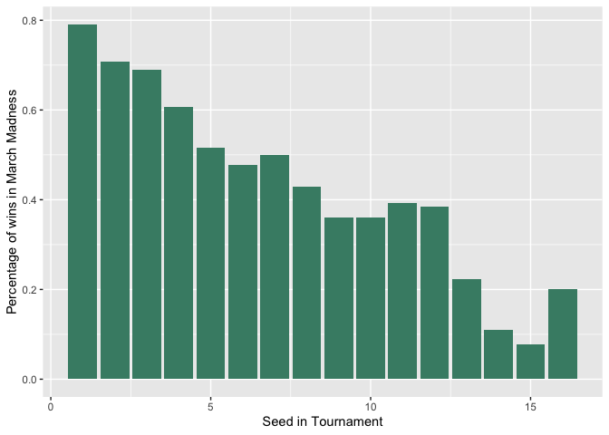
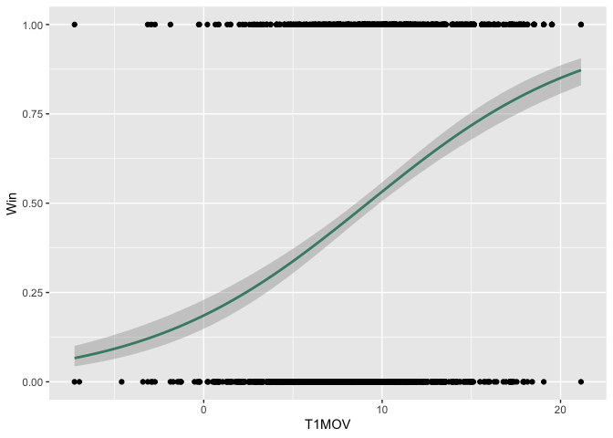
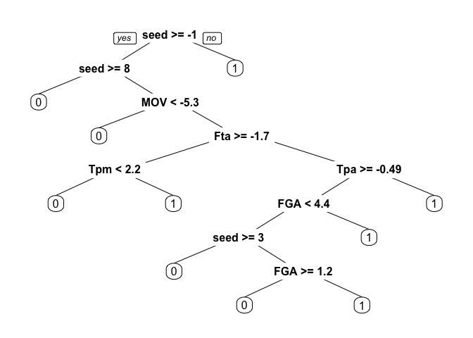
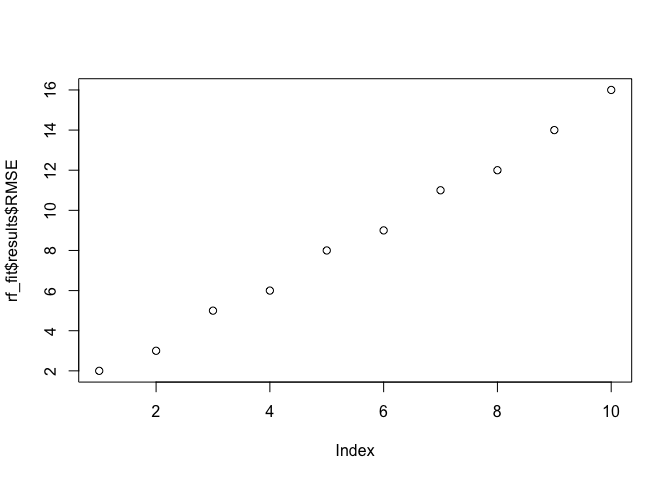
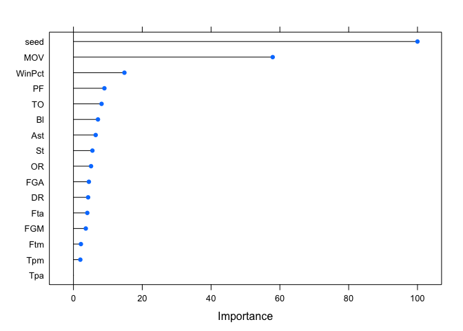

DSB\_project
================
Danish Siddiquie
30/09/2021

Since 2011, the NCAA tournament has had 68 teams competing in its field.
Eight of those teams compete in the “First Four” — four games that take
place before the first round of the tournament. Virtually all bracket
pools disregard these games and only have players pick from the first
round, when 64 teams remain.

Therefore, there are 63 games in a normal NCAA tournament bracket.

As such, the number of possible outcomes for a bracket is 2^63, or
9,223,372,036,854,775,808. That’s 9.2 quintillion.

Thus, if 300 million people are playing, the probability of even one
person winning can be 1 in 3 trillion

Thus, the expected payout for Warren Buffet would be
(1/3000000000000)\*(1000000000) = 0.0003

``` r
GameStats = read.csv('RegularSeasonDetailedResults.csv') 
TourneyResults = read.csv('NCAATourneyDetailedResults.csv')
Slots = read.csv('NCAATourneySlots.csv')
Seeds = read.csv('NCAATourneySeeds.csv')
teams = read.csv('Teams.csv')
```

# Data Cleaning to obtain train data

# Seperate the winning and losing team stats and stack them on top of each other using rbind. We do this to obtain the stats for each team in each match as an individual row

``` r
#Extract columns that correspond to the winning team in a each REGULAR SEASON match
Winners = GameStats[,c(1,2,3,4,6,9:21)] 
colnames(Winners)[2:18] = c("Daynum","Team","WScore","LScore","Fgm","Fga","Tpm","Tpa",
                            "Ftm","Fta","OR","DR","Ast",
                            "TO","St","Bl","PF")

# Win = 1 corresponds to regular season match win. Only used to calculate MOV ahead. WILL NOT BE USED AFTER
Winners$Win = 1

#Extract columns that correspond to the winning team in a each REGULAR SEASON match
Losers = GameStats[,c(1,2,4,5,6,22:34)] 
colnames(Losers)[2:18] = c("Daynum","WScore","Team","LScore","Fgm","Fga","Tpm","Tpa",
                           "Ftm","Fta","OR","DR","Ast",
                           "TO","St","Bl","PF")
Losers$Win = 0

#rbind all matches so that we get stats of each winning and losing team as seperate rows
FullGame = rbind(Winners,Losers) 

# Calculate Margin of Victory for each team in each match (positive for winning team, negative for losing team)
FullGame<-sqldf("select *,
      case when Win = 1 then WScore - LScore
      else LScore - WScore end as MOV
      from FullGame")
write.csv(FullGame,"FullGame.csv")
```

# Obtain seed (1 to 16, irrespectiv of region) of each team fom seeds table

``` r
temp1<- sqldf("select season,teamID, substr(seed,2,2) as seed  from Seeds
              ")
```

# Summary the REGULAR SEASON stats of all teams for all years

``` r
#HERE, WE DO NOT INCLUDE WIN COLUMN SINCE WE DO NOT CARE ABOUT REGULAR SEASON WIN, ONLY CARE ABOUT STATS
AnnualSummaries<-sqldf("SELECT Team,
    Season,
    AVG(win) AS WinPct,
    AVG(FGM) AS FGM,
    AVG(FGA) AS FGA,
    AVG(Tpm),
    AVG(Tpa),
    AVG(Ftm),
    AVG(Fta),
    AVG(`OR`),
    AVG(DR),
    AVG(Ast),
    AVG(`TO`),
    AVG(St),
    AVG(Bl),
    AVG(PF),
    AVG(MOV)
    FROM   FullGame
GROUP BY Team , Season")

#Append to the annual regular season stats the seed that a team got for that March Madness season 
AnnualSummaries<-sqldf("
select  a.*,
        seed
from    AnnualSummaries as a
join    temp1 as t
on      a.Season = t.Season
and     a.Team = t.TeamID")

colnames(AnnualSummaries)[6:18] = c("Tpm","Tpa",
                            "Ftm","Fta","OR","DR","Ast",
                            "TO","St","Bl","PF","MOV","seed")

AnnualSummaries$seed<-as.numeric(AnnualSummaries$seed)
```

# For each season before 2014 (Training data), get the March madness match ups, and join the annual stats of their regular season for both the winning team and losing team seperately. Here, Win = 1 corresponds to March Madness Win

``` r
w_stats<-sqldf("with w as
(select Season,
        WTeamID,
        LTeamID
from    TourneyResults
where Season <= 2014)
select  a.Season,
        WTeamID as Team1,
        LTeamID as Team2,
        WinPCT  as T1WinPCT,
        a.FGM   as T1FGM,
        a.FGA       as T1FGA,
        a.Tpm       as T1Tpm,
        a.Tpa       as T1Tpa,
        a.Ftm       as T1Ftm,
        a.Fta       as T1Fta,
        a.`OR`  as T1OR,
       a.DR     as T1DR,
        a.Ast       as T1Ast,
        a.`TO`  as T1TO,
        a.St        as T1St,
        a.Bl        as T1Bl,
        a.PF        as T1PF,
        a.MOV as T1MOV,
        a.Seed as T1Seed,
case    when WTeamID is not null then 1 end as Win
from    AnnualSummaries as a
join    w as t
on      a.Season = t.Season
and     a.Team = t.WTeamID
order by a.season ,Team1, Team2")

l_stats<-sqldf("with l as
(select Season as s,
        LTeamID,
        WTeamID
from    TourneyResults
where Season <= 2014)
select  a.Season,
        LTeamID as Team1,
        WTeamID as Team2,
        WinPCT  as T1WinPCT,
        FGM     as T1FGM,
        FGA     as T1FGA,
        Tpm     as T1Tpm,
        Tpa     as T1Tpa,
        Ftm     as T1Ftm,
        Fta     as T1Fta,
        `OR`    as T1OR,
        DR      as T1DR,
        Ast     as T1Ast,
        `TO`    as T1TO,
        St      as T1St,
        Bl      as T1Bl,
        PF      as T1PF,
        MOV as T1MOV,
        Seed as T1Seed,
case    when LTeamID is not null then 0 end as Win
from    AnnualSummaries as a
join    l as t
on      a.Season = t.s
and     a.Team = t.LTeamID
order by season,Team2, Team1")
```

# Get opponent teams REGULAR SEASON (Annual) stats as columns for both the MARCH MADNESS winning team and losing team

``` r
l_temp<-sqldf("
       select `l`.`Season` AS `Season`,`l`.
       `Team1` AS `Team1`,
       `l`.`Team2` AS `Team2`,
       `l`.`T1WinPCT` AS `T1WinPCT`,
       `l`.`T1FGM` AS `T1FGM`,
       `l`.`T1FGA` AS `T1FGA`,
       `l`.`T1Tpm` AS `T1Tpm`,
       `l`.`T1Tpa` AS `T1Tpa`,
       `l`.`T1Ftm` AS `T1Ftm`,
       `l`.`T1Fta` AS `T1Fta`,
       `l`.`T1OR` AS `T1OR`,
       `l`.`T1DR` AS `T1DR`,
       `l`.`T1Ast` AS `T1Ast`,
       `l`.`T1TO` AS `T1TO`,
       `l`.`T1St` AS `T1St`,
       `l`.`T1Bl` AS `T1Bl`,
       `l`.`T1PF` AS `T1PF`,
       `l`.`T1MOV` as T1MOV,
       l.T1Seed as T1Seed,
       `l`.`Win` AS `Win`,
       `a`.`WinPct` AS `T2WinPCT`,
       `a`.`FGM` AS `T2FGM`,
       `a`.`FGA` AS `T2FGA`,
       `a`.`Tpm` AS `T2Tpm`,
       `a`.`Tpa` AS `T2Tpa`,
       `a`.`Ftm` AS `T2Ftm`,
       `a`.`Fta` AS `T2Fta`,
       `a`.`OR` AS `T2OR`,
       `a`.`DR` AS `T2DR`,
       `a`.`Ast` AS `T2Ast`,
       `a`.`TO` AS `T2TO`,
       `a`.`St` AS `T2St`,
       `a`.`Bl` AS `T2Bl`,
       `a`.`PF` AS `T2PF`,
       a.MOV AS T2MOV,
       a.Seed as T2Seed
       from (`l_stats` `l` join `AnnualSummaries` `a` 
       on(((`l`.`Team2` = `a`.`Team`) and (`l`.`Season` = `a`.`Season`))))
       order by season ASC,Team1, Team2")


w_temp<-sqldf("select `w`.`Season` AS `Season`,
 `w`.`Team1` AS `Team1`,
 `w`.`Team2` AS `Team2`,
 `w`.`T1WinPCT` AS `T1WinPCT`,
 `w`.`T1FGM` AS `T1FGM`,
 `w`.`T1FGA` AS `T1FGA`,
 `w`.`T1Tpm` AS `T1Tpm`,
 `w`.`T1Tpa` AS `T1Tpa`,
 `w`.`T1Ftm` AS `T1Ftm`,
 `w`.`T1Fta` AS `T1Fta`,
 `w`.`T1OR` AS `T1OR`,
 `w`.`T1DR` AS `T1DR`,
 `w`.`T1Ast` AS `T1Ast`,
 `w`.`T1TO` AS `T1TO`,
 `w`.`T1St` AS `T1St`,
 `w`.`T1Bl` AS `T1Bl`,
 `w`.`T1PF` AS `T1PF`,
 w.T1MOV as T1MOV,
 w.T1Seed as T1Seed,
 `w`.`Win` AS `Win`,
 `a`.`WinPct` AS `T2WinPCT`,
 `a`.`FGM` AS `T2FGM`,
 `a`.`FGA` AS `T2FGA`,
 `a`.`Tpm` AS `T2Tpm`,
 `a`.`Tpa` AS `T2Tpa`,
 `a`.`Ftm` AS `T2Ftm`,
 `a`.`Fta` AS `T2Fta`,
 `a`.`OR` AS `T2OR`,
 `a`.`DR` AS `T2DR`,
 `a`.`Ast` AS `T2Ast`,
 `a`.`TO` AS `T2TO`,
 `a`.`St` AS `T2St`,
 `a`.`Bl` AS `T2Bl`,
 `a`.`PF` AS `T2PF`,
 a.MOV AS T2MOV,
 a.Seed as T2Seed
 from (`w_stats` `w` 
 join `AnnualSummaries` `a` 
 on(((`w`.`Team2` = `a`.`Team`) and (`w`.`Season` = `a`.`Season`))))
 order by season ASC,Team1, Team2")
```

# Union the winning and losing team, and subtract Team 1’s stats from Team 2’s to get the RELATIVE stats between two teams, to see how that correlates to a WIN (Win = 1) or a Loss (Win = 0 )

# Note that the data has two instances of each match-up. Team 1 vs Team 2 with relative stats with Win = 1, and Team 2 vs Team 1 with the negated relative stats with Win = 0. This is so that the data can train both on how a winning team looks like and how a losing team looks like

``` r
TrainingData<-sqldf("
with merged as
(select     *
from    w_temp
union   
select  *
from    l_temp)
select  Season,
        Team1,
        Team2,
        T1WinPCT - T2WinPct as WinPct,  
        T1FGM - T2FGM as FGM,
        T1FGA - T2FGA as FGA,
        T1Tpm - T2Tpm as Tpm,
        T1Tpa - T2Tpa as Tpa,
        T1Ftm - T2Ftm as Ftm,
        T1Fta - T2Fta as Fta,
        T1OR - T2OR as `OR`,
        T1DR - T2DR as DR,
        T1Ast - T2Ast as Ast,
        T1TO - T2TO as `TO`,
        T1St - T2St as St,
        T1Bl - T2Bl as Bl,
        T1PF - T2PF as PF,
        T1MOV - T2MOV as MOV,
        T1Seed - T2Seed as seed,
        Win
from    merged
order by season ASC,Team1, Team2")

#Make Win as a factor variable
#Remove Season, Team1, and Team2 columns since Season and names are redundant in predicting what a winning team looks like
TrainingData$Win<-factor(TrainingData$Win)
TrainingData<-TrainingData%>%select(-c(Season,Team1,Team2))
```

``` r
str(TrainingData)
```

    ## 'data.frame':    1560 obs. of  17 variables:
    ##  $ WinPct: num  -0.0179 0.1509 0.1262 0.1832 0.2377 ...
    ##  $ FGM   : num  0.5982 4.2569 0.0881 3.0956 5.4938 ...
    ##  $ FGA   : num  2.24 10.26 3.41 5.04 9.85 ...
    ##  $ Tpm   : num  -1.174 -0.126 2.236 -1.255 1.76 ...
    ##  $ Tpa   : num  -1.77 1.01 5.94 -1.7 4.59 ...
    ##  $ Ftm   : num  -1.268 -0.238 1.469 0.181 4.674 ...
    ##  $ Fta   : num  -1.696 0.355 0.867 2.161 5.448 ...
    ##  $ OR    : num  2.353 3.243 0.879 3.791 2.213 ...
    ##  $ DR    : num  -1.696 2.32 0.743 0.772 1.919 ...
    ##  $ Ast   : num  -1.71 1.9 0.91 0.74 3.44 ...
    ##  $ TO    : num  1.786 0.237 -0.114 2.012 0.717 ...
    ##  $ St    : num  2.17 1.66 -1.67 1.01 1.6 ...
    ##  $ Bl    : num  -1.558 0.698 -0.686 -1.431 1.249 ...
    ##  $ PF    : num  -0.0268 -0.8952 1.05 1.5242 1.8534 ...
    ##  $ MOV   : num  0.75446 6.09332 -0.00238 6.06106 10.30911 ...
    ##  $ seed  : num  3 -8 -1 -4 -15 8 3 3 7 8 ...
    ##  $ Win   : Factor w/ 2 levels "0","1": 1 2 1 2 2 1 2 2 1 2 ...

# Data Visualization

``` r
c<-sqldf("select Season,a.Team1,a.Team2, T1Winpct, T1Seed,T1MOV,a.Win
         from w_temp as a
         union
         select Season,b.Team1,b.Team2, T1Winpct, T1Seed,T1MOV,b.Win
         from l_temp as b")

temp<-c%>%group_by(T1Seed,Win)%>%tally

temp<-c%>%group_by(T1Seed)%>%summarise(perc = length(Win[Win==1])/(length(Win[Win==1])+length(Win[Win==0])))

                                 
ggplot(temp,aes(T1Seed,perc))+
  geom_bar(stat="identity",fill="aquamarine4")+
  labs(x="Seed in Tournament",y="Percentage of wins in March Madness")
```

<!-- -->

``` r
temp<-c%>%filter(Season==2013)


ggplot(c,aes(T1MOV,Win))+
  geom_point(stat="identity")+
  geom_smooth(method = "glm",col="aquamarine4",
    method.args = list(family = "binomial"))
```

    ## `geom_smooth()` using formula 'y ~ x'

<!-- -->

# Logistic Regression model

``` r
#Repeated Cross validation with 10 folds and 3 repeats
trctrl = trainControl(method = "repeatedcv", number = 10,repeats = 3)

mylogit = train(Win~.,
data = TrainingData,
method = "glm",
family="binomial",
trControl=trctrl)

mylogit
```

    ## Generalized Linear Model 
    ## 
    ## 1560 samples
    ##   16 predictor
    ##    2 classes: '0', '1' 
    ## 
    ## No pre-processing
    ## Resampling: Cross-Validated (10 fold, repeated 3 times) 
    ## Summary of sample sizes: 1404, 1404, 1404, 1404, 1404, 1404, ... 
    ## Resampling results:
    ## 
    ##   Accuracy   Kappa    
    ##   0.6888889  0.3777778

# Lasso regression Model tuning to find best lambda value which optimizes accuracy

``` r
trctrl = trainControl(method = "cv", number = 5)
reg_lasso<-train(Win~.,
               data=TrainingData,
                   method="glmnet",
                   family="binomial",
                   trControl=trctrl,
    tuneGrid = expand.grid(alpha = 1,  lambda = seq(0.001,0.1,by = 0.001)))

reg_lasso$bestTune
```

    ##    alpha lambda
    ## 86     1  0.086

\#Final Lasso regression model

``` r
trctrl = trainControl(method = "repeatedcv", number = 10,repeats = 3)
reg_lasso<-train(Win~. ,
               data=TrainingData,
                   method="glmnet",
                   family="binomial",
                   trControl=trctrl,
    tuneGrid = expand.grid(alpha = 1,  lambda = reg_lasso$bestTune[,2]))

reg_lasso
```

    ## glmnet 
    ## 
    ## 1560 samples
    ##   16 predictor
    ##    2 classes: '0', '1' 
    ## 
    ## No pre-processing
    ## Resampling: Cross-Validated (10 fold, repeated 3 times) 
    ## Summary of sample sizes: 1404, 1404, 1404, 1404, 1404, 1404, ... 
    ## Resampling results:
    ## 
    ##   Accuracy   Kappa    
    ##   0.7047009  0.4094017
    ## 
    ## Tuning parameter 'alpha' was held constant at a value of 1
    ## Tuning
    ##  parameter 'lambda' was held constant at a value of 0.086

``` r
summary(reg_lasso$finalModel)
```

    ##             Length Class      Mode     
    ## a0            78   -none-     numeric  
    ## beta        1248   dgCMatrix  S4       
    ## df            78   -none-     numeric  
    ## dim            2   -none-     numeric  
    ## lambda        78   -none-     numeric  
    ## dev.ratio     78   -none-     numeric  
    ## nulldev        1   -none-     numeric  
    ## npasses        1   -none-     numeric  
    ## jerr           1   -none-     numeric  
    ## offset         1   -none-     logical  
    ## classnames     2   -none-     character
    ## call           5   -none-     call     
    ## nobs           1   -none-     numeric  
    ## lambdaOpt      1   -none-     numeric  
    ## xNames        16   -none-     character
    ## problemType    1   -none-     character
    ## tuneValue      2   data.frame list     
    ## obsLevels      2   -none-     character
    ## param          1   -none-     list

# Decision Tree Model

``` r
#Train a simple decision tree
#Train decision tree using gini criteria:

dtree_fit = train(Win~.,
data = TrainingData,
method = "rpart",
parms = list(split = "gini"), 
trControl=trctrl,
tuneLength = 10)

prp(dtree_fit$finalModel)
```

<!-- -->

``` r
dtree_fit
```

    ## CART 
    ## 
    ## 1560 samples
    ##   16 predictor
    ##    2 classes: '0', '1' 
    ## 
    ## No pre-processing
    ## Resampling: Cross-Validated (10 fold, repeated 3 times) 
    ## Summary of sample sizes: 1404, 1404, 1404, 1404, 1404, 1404, ... 
    ## Resampling results across tuning parameters:
    ## 
    ##   cp           Accuracy   Kappa    
    ##   0.001923077  0.6536325  0.3072650
    ##   0.002564103  0.6600427  0.3200855
    ##   0.002884615  0.6632479  0.3264957
    ##   0.003205128  0.6632479  0.3264957
    ##   0.003846154  0.6722222  0.3444444
    ##   0.005128205  0.6779915  0.3559829
    ##   0.005555556  0.6799145  0.3598291
    ##   0.005769231  0.6820513  0.3641026
    ##   0.008547009  0.6818376  0.3636752
    ##   0.402564103  0.6130342  0.2260684
    ## 
    ## Accuracy was used to select the optimal model using the largest value.
    ## The final value used for the model was cp = 0.005769231.

# Random-Forest Model

``` r
trctrl = trainControl(method = "cv", number = 5)
rf_fit = train(Win~.,
               data=TrainingData,
                   method="rf",
                   trControl=trctrl,
                   tuneLength = 10)
```

``` r
plot(rf_fit$results$mtry,rf_fit$results$RMSE)
```

<!-- -->

``` r
rf_fit
```

    ## Random Forest 
    ## 
    ## 1560 samples
    ##   16 predictor
    ##    2 classes: '0', '1' 
    ## 
    ## No pre-processing
    ## Resampling: Cross-Validated (5 fold) 
    ## Summary of sample sizes: 1248, 1248, 1248, 1248, 1248 
    ## Resampling results across tuning parameters:
    ## 
    ##   mtry  Accuracy   Kappa    
    ##    2    0.6782051  0.3564103
    ##    3    0.6743590  0.3487179
    ##    5    0.6756410  0.3512821
    ##    6    0.6698718  0.3397436
    ##    8    0.6711538  0.3423077
    ##    9    0.6788462  0.3576923
    ##   11    0.6756410  0.3512821
    ##   12    0.6730769  0.3461538
    ##   14    0.6756410  0.3512821
    ##   16    0.6711538  0.3423077
    ## 
    ## Accuracy was used to select the optimal model using the largest value.
    ## The final value used for the model was mtry = 9.

``` r
Importance = varImp(rf_fit)
plot(Importance)
```

<!-- -->

# Testing

# Prediction function, which will take the year we are predicting for, and the model we will be using to predict

The function will do the following:

  - Obtain the match-ups (based on th slot they are playing in) for
    first round in the particular March Madness year we are predicting
    for. In the first round, the match up is simple. Each first rank
    plays from each region with the 16th rank (lowest) from each region,
    2nd plays with 15th and so on. We have the data of each seed for
    each season, so we can obtain the match ups.

  - Obtain the Annual summary stats (Regular season stats) for each team
    match up

  - Calculate the difference between stats for each team match up to get
    the relative stats (Since our training data is in that format).
    These will be our testing data points

  - Predict the winner for each match

  - Store the ids of each winner, and match these teams for the second
    round based on the slots they won in

  - Repeat for each round till round 6 (Finals)

<!-- end list -->

``` r
PredictWinners = function(thisModel,Year,lambda){
  
  mycolnames = c("Season","Team1","Team2","WinPct","FGM","FGA","Tpm","Tpa",
                 "Ftm","Fta","OR","DR","Ast","TO","St","Bl","PF","MOV","seed")
  TheseSlots = filter(Slots,Season==Year) 
  TheseSeeds = filter(Seeds,Season==Year)
  
  TheseSlots$Prediction = 0 #Initiate to store predictions
  
#Round 1
  
  Round1Games = as.data.frame(matrix(0, ncol = 38, nrow = 32)) 
  colnames(Round1Games)[1:38] = mycolnames
  Round1Games$Season = Year


  for (i in 1:32){
    Round1Games[i,"Team1"] =
      TheseSeeds[which(TheseSeeds$Seed == as.character(TheseSlots$StrongSeed[i])),3]
    Round1Games[i,"Team2"] =
      TheseSeeds[which(TheseSeeds$Seed == as.character(TheseSlots$WeakSeed[i])),3]
    Round1Games[i,4:19] = AnnualSummaries[which(AnnualSummaries$Season==Round1Games[i,"Season"]
                                                & AnnualSummaries$Team ==Round1Games[i,"Team1"]),3:18]
    Round1Games[i,23:38] = AnnualSummaries[which(AnnualSummaries$Season==Round1Games[i,"Season"]
                                                 & AnnualSummaries$Team ==Round1Games[i,"Team2"]),3:18]
  }
  
  #print(Round1Games)
#Create predictions on round 1
  
  temp = Round1Games[,4:19] - Round1Games[,23:38]
  colnames(temp)[1:16] = c("WinPct","FGM","FGA","Tpm","Tpa",
                 "Ftm","Fta","OR","DR","Ast","TO","St","Bl","PF","MOV","seed")
  
  pred = predict(thisModel, temp,type="prob")
  pred = ifelse(pred[,2]>lambda,1,0)
  #print(pred)
  
  Round1Pred = data.frame(Slot = Slots[1:32,"Slot"], PredictedWinner = 0) 
  for (i in 1:32){
    if (pred[i] == 1){
      Round1Pred[i,"PredictedWinner"] = Round1Games[i,"Team1"]
      } 
    else{
      Round1Pred[i,"PredictedWinner"] = Round1Games[i,"Team2"]
      }
    }
  
  TheseSlots$Prediction[1:32] = Round1Pred[,"PredictedWinner"]
  
  
  ## Round 2
#Use the predicted classes to construct round 2
  
  Round2Games = as.data.frame(matrix(0, ncol = 38, nrow = 16)) 
  colnames(Round2Games)[1:38] = mycolnames
  Round2Games$Season = Year
  for (i in 1:16){
    Round2Games[i,"Team1"] = 
      Round1Pred[which(Round1Pred$Slot==as.character(TheseSlots$StrongSeed[i+32])), "PredictedWinner"]
    Round2Games[i,"Team2"] = Round1Pred[which(Round1Pred$Slot ==
                                                as.character(TheseSlots$WeakSeed[i+32])),
                                        "PredictedWinner"]
    Round2Games[i,4:19] = AnnualSummaries[which(AnnualSummaries$Season==Round2Games[i,"Season"]
                                                & AnnualSummaries$Team ==Round2Games[i,"Team1"]),3:18]
    Round2Games[i,23:38] = AnnualSummaries[which(AnnualSummaries$Season==Round2Games[i,"Season"]
                                                 & AnnualSummaries$Team ==Round2Games[i,"Team2"]),3:18]
    }
#Create predictions on round 2
  temp = Round2Games[,4:19] - Round2Games[,23:38]
  colnames(temp)[1:16] = c("WinPct","FGM","FGA","Tpm","Tpa",
                 "Ftm","Fta","OR","DR","Ast","TO","St","Bl","PF","MOV","seed")
  
  pred = predict(thisModel, temp,type="prob")
  pred = ifelse(pred[,2]>lambda,1,0)
  
  Round2Pred = data.frame(Slot = Slots[33:48,"Slot"],PredictedWinner = 0) 
  for (i in 1:16){
    if (pred[i] == 1){
      Round2Pred[i,"PredictedWinner"] = Round2Games[i,"Team1"]
      } 
    else{
      Round2Pred[i,"PredictedWinner"] = Round2Games[i,"Team2"]
      }
    }
  
  TheseSlots$Prediction[33:48] = Round2Pred[,"PredictedWinner"]
  
  
  ## Round 3
  
  Round3Games = as.data.frame(matrix(0, ncol = 38, nrow = 8)) 
  colnames(Round3Games)[1:38] = mycolnames
  Round3Games$Season = Year
  for (i in 1:8){
    Round3Games[i,"Team1"] =
      Round2Pred[which(Round2Pred$Slot==as.character(TheseSlots$StrongSeed[i+48])), "PredictedWinner"]
    Round3Games[i,"Team2"] = Round2Pred[which(Round2Pred$Slot ==
                                                as.character(TheseSlots$WeakSeed[i+48])),
                                        "PredictedWinner"]
    Round3Games[i,4:19] = AnnualSummaries[which(AnnualSummaries$Season==Round3Games[i,"Season"]
                                                & AnnualSummaries$Team ==Round3Games[i,"Team1"]),3:18]
   Round3Games[i,23:38] = AnnualSummaries[which(AnnualSummaries$Season==Round3Games[i,"Season"]
                                                 & AnnualSummaries$Team ==Round3Games[i,"Team2"]),3:18]
  }
#Create predictions on round 3
  temp = Round3Games[,4:19] - Round3Games[,23:38]
  colnames(temp)[1:16] = c("WinPct","FGM","FGA","Tpm","Tpa",
                 "Ftm","Fta","OR","DR","Ast","TO","St","Bl","PF","MOV","seed")
  
  pred = predict(thisModel, temp,type="prob")
  pred = ifelse(pred[,2]>lambda,1,0)
  
  Round3Pred = data.frame(Slot = Slots[49:56,"Slot"],PredictedWinner = 0)


  for (i in 1:8){
    if (pred[i] == 1){
      Round3Pred[i,"PredictedWinner"] = Round3Games[i,"Team1"]
      }
    else{
      Round3Pred[i,"PredictedWinner"] = Round3Games[i,"Team2"]
      }
    }
  
  TheseSlots$Prediction[49:56] = Round3Pred[,"PredictedWinner"]
  
  
  ## Round 4
  
  Round4Games = as.data.frame(matrix(0, ncol = 38, nrow = 4)) 
  colnames(Round4Games)[1:38] = mycolnames
  Round4Games$Season = Year
  
  for (i in 1:4){
    Round4Games[i,"Team1"] =
      Round3Pred[which(Round3Pred$Slot==as.character(TheseSlots$StrongSeed[i+56])), "PredictedWinner"]
    Round4Games[i,"Team2"] =
      Round3Pred[which(Round3Pred$Slot == as.character(TheseSlots$WeakSeed[i+56])),
                 "PredictedWinner"]
    Round4Games[i,4:19] = AnnualSummaries[which(AnnualSummaries$Season==Round4Games[i,"Season"]
                                                & AnnualSummaries$Team ==Round4Games[i,"Team1"]),3:18]
    Round4Games[i,23:38] = AnnualSummaries[which(AnnualSummaries$Season==Round4Games[i,"Season"]
                                                 & AnnualSummaries$Team ==Round4Games[i,"Team2"]),3:18]
    }
#Create predictions on round 4
  temp = Round4Games[,4:19] - Round4Games[,23:38]
  colnames(temp)[1:16] = c("WinPct","FGM","FGA","Tpm","Tpa",
                 "Ftm","Fta","OR","DR","Ast","TO","St","Bl","PF","MOV","seed")
  
  pred = predict(thisModel, temp,type="prob")
  pred = ifelse(pred[,2]>lambda,1,0)
  
  Round4Pred = data.frame(Slot = Slots[57:60,"Slot"],PredictedWinner = 0) 
  for (i in 1:4){
    if (pred[i] == 1){
      Round4Pred[i,"PredictedWinner"] = Round4Games[i,"Team1"]
      } 
    else{
      Round4Pred[i,"PredictedWinner"] = Round4Games[i,"Team2"]
      }
    }
  
  TheseSlots$Prediction[57:60] = Round4Pred[,"PredictedWinner"]
  
  
  ## Round 5
  
  Round5Games = as.data.frame(matrix(0, ncol = 38, nrow = 2)) 
  colnames(Round5Games)[1:38] = mycolnames
  Round5Games$Season = Year

  for (i in 1:2){
    Round5Games[i,"Team1"] =
      Round4Pred[which(Round4Pred$Slot==as.character(TheseSlots$StrongSeed[i+60])), "PredictedWinner"]
    Round5Games[i,"Team2"] =
      Round4Pred[which(Round4Pred$Slot == as.character(TheseSlots$WeakSeed[i+60])),
                 "PredictedWinner"]
    Round5Games[i,4:19] = AnnualSummaries[which(AnnualSummaries$Season==Round4Games[i,"Season"]
                                                & AnnualSummaries$Team ==Round4Games[i,"Team1"]),3:18]
    Round5Games[i,23:38] = AnnualSummaries[which(AnnualSummaries$Season==Round4Games[i,"Season"]
                                                 & AnnualSummaries$Team ==Round4Games[i,"Team2"]),3:18]
    }
#Create predictions on round 5
  temp = Round5Games[,4:19] - Round5Games[,23:38]
  colnames(temp)[1:16] = c("WinPct","FGM","FGA","Tpm","Tpa",
                 "Ftm","Fta","OR","DR","Ast","TO","St","Bl","PF","MOV","seed")
  
  pred = predict(thisModel, temp,type="prob")
  pred = ifelse(pred[,2]>lambda,1,0)
  
  Round5Pred = data.frame(Slot = Slots[61:62,"Slot"],PredictedWinner = 0) 
  for (i in 1:2){
    if (pred[i] == 1){
      Round5Pred[i,"PredictedWinner"] = Round5Games[i,"Team1"]
      } 
    else{
      Round5Pred[i,"PredictedWinner"] = Round5Games[i,"Team2"]
      }
    }
  TheseSlots$Prediction[61:62] = Round5Pred[,"PredictedWinner"]
  
  
  ## Round 6
  
  Round6Games = as.data.frame(matrix(0, ncol = 38, nrow = 1)) 
  colnames(Round6Games)[1:38] = mycolnames
  Round6Games$Season = Year
  for (i in 1:1){
    Round6Games[i,"Team1"] =
      Round5Pred[which(Round5Pred$Slot==as.character(TheseSlots$StrongSeed[i+62])), "PredictedWinner"]
    Round6Games[i,"Team2"] =
      Round5Pred[which(Round5Pred$Slot == as.character(TheseSlots$WeakSeed[i+62])),
                 "PredictedWinner"]
    Round6Games[i,4:19] = AnnualSummaries[which(AnnualSummaries$Season==Round6Games[i,"Season"]
                                                & AnnualSummaries$Team ==Round6Games[i,"Team1"]),3:18]
    Round6Games[i,23:38] = AnnualSummaries[which(AnnualSummaries$Season==Round6Games[i,"Season"]
                                                 & AnnualSummaries$Team ==Round6Games[i,"Team2"]),3:18]

  }

#Create predictions on round 6
  temp = Round6Games[,4:19] - Round6Games[,23:38]
  colnames(temp)[1:16] = c("WinPct","FGM","FGA","Tpm","Tpa",
                 "Ftm","Fta","OR","DR","Ast","TO","St","Bl","PF","MOV","seed")
  
  pred = predict(thisModel, temp,type="prob")
  pred = ifelse(pred[,2]>lambda,1,0)
  
  Round6Pred = data.frame(Slot = Slots[63,"Slot"],PredictedWinner = 0) 
  for (i in 1:1){
    if (pred[i] == 1){
      Round6Pred[i,"PredictedWinner"] = Round6Games[i,"Team1"]
      } 
    else{
      Round6Pred[i,"PredictedWinner"] = Round6Games[i,"Team2"]
      }
  }

  
  TheseSlots$Prediction[63] = Round6Pred[,"PredictedWinner"]
  
  
  TheseResults = filter(TourneyResults, Season==Year) 
  TheseSlots$Actual = 0

  for (i in 1:63){
    TheseSlots[i,"Actual"] =
      TheseResults[which(as.character(TheseSlots[i,"Slot"])==TheseResults$Slot), "WTeamID"]
    }

  Rounds = 0
  for (i in 1:32){
    Rounds[i] = 1
    }

  for (i in 33:48){
    Rounds[i] = 2
    }

  for (i in 49:56){
    Rounds[i] = 3
    }

  for (i in 57:60){
    Rounds[i] = 4
    }

  for (i in 61:62){
    Rounds[i] = 5
    }

  for (i in 63){
    Rounds[i] = 6
    }


  Results = data.frame(Round = Rounds, 
                       Predicted = TheseSlots$Prediction,
                       Winner = TheseSlots$Actual)
  return(Results) 
  
}
```

A typical scoring system for March Madness brackets gives 1 point for
round 1 successful predictions, 2 points for round 2 successful
predictions, 4 points for round 3, 8 points for round 4, 16 points for
round 5, and 32 points for round 6.

# The function below Calculates the expected points accumulated with our predictions

``` r
pred_points<-function(predTable){
  
  points = 0
  
  for (i in 1:32){
    if(predTable$Predicted[i]==predTable$Winner[i]){
      points = points + 1
    }
  }
  
    for (i in 33:48){
      if(predTable$Predicted[i]==predTable$Winner[i]){
        points = points + 2
      }
    }
  
  for (i in 49:56){
    if(predTable$Predicted[i]==predTable$Winner[i]){
      points = points + 4
    }
  }
  
  for (i in 57:60){
    if(predTable$Predicted[i]==predTable$Winner[i]){
      points = points + 8
    }
  }
  
  for (i in 61:62){
    if(predTable$Predicted[i]==predTable$Winner[i]){
      points = points + 16
    }
  }
  
  for (i in 63){
    if(predTable$Predicted[i]==predTable$Winner[i]){
      points = points + 32
    }
  }
  
  return(points)
}
```

\#Compare performance at different Lambda

``` r
performance = setNames(data.frame(matrix(ncol = 2, nrow = 401)), c("Cutoff","points"))
performance$Cutoff = seq(0.3,0.7,.001)
```

``` r
for (i in 1:401){
  lambda = performance$Cutoff[i]
  logit_Pred_2015<- PredictWinners(mylogit,2015,lambda)
  performance$points[i]<-pred_points(logit_Pred_2015)
}
```

\#Year 2015

``` r
performance[which(performance$points == max(performance$points)),]
```

    ##     Cutoff points
    ## 236  0.535    119

\#Year 2016

``` r
for (i in 1:401){
  lambda = performance$Cutoff[i]
  logit_Pred_2016<- PredictWinners(mylogit,2016,lambda)
  performance$points[i]<-pred_points(logit_Pred_2016)
}

performance[which(performance$points == max(performance$points)),]
```

    ##     Cutoff points
    ## 197  0.496    119
    ## 198  0.497    119
    ## 199  0.498    119

\#Run the function to see predictions using each model in each year
(Lambda threshold constant at 0.5)

``` r
lasso_Pred_2015 = PredictWinners(reg_lasso,2015,0.5)
lasso_Pred_2016 = PredictWinners(reg_lasso,2016,0.5)
lasso_Pred_2017 = PredictWinners(reg_lasso,2017,0.5)

logit_Pred_2015 = PredictWinners(mylogit,2015,0.5)
logit_Pred_2016 = PredictWinners(mylogit,2016,0.5)
logit_Pred_2017 = PredictWinners(mylogit,2017,0.5)

dtree_Pred_2015 = PredictWinners(dtree_fit,2015,0.5)
dtree_Pred_2016 = PredictWinners(dtree_fit,2016,0.5)
dtree_Pred_2017 = PredictWinners(dtree_fit,2017,0.5)

rf_Pred_2015 = PredictWinners(rf_fit,2015,0.5)
rf_Pred_2016 = PredictWinners(rf_fit,2016,0.5)
rf_Pred_2017 = PredictWinners(rf_fit,2017,0.5)

logit_Pred_2016
```

    ##    Round Predicted Winner
    ## 1      1      1314   1314
    ## 2      1      1462   1462
    ## 3      1      1452   1372
    ## 4      1      1246   1246
    ## 5      1      1231   1231
    ## 6      1      1323   1323
    ## 7      1      1458   1458
    ## 8      1      1425   1344
    ## 9      1      1438   1438
    ## 10     1      1277   1292
    ## 11     1      1428   1428
    ## 12     1      1235   1235
    ## 13     1      1345   1114
    ## 14     1      1211   1211
    ## 15     1      1393   1393
    ## 16     1      1139   1139
    ## 17     1      1242   1242
    ## 18     1      1437   1437
    ## 19     1      1274   1274
    ## 20     1      1143   1218
    ## 21     1      1268   1268
    ## 22     1      1112   1455
    ## 23     1      1234   1234
    ## 24     1      1163   1163
    ## 25     1      1332   1332
    ## 26     1      1328   1328
    ## 27     1      1401   1401
    ## 28     1      1181   1181
    ## 29     1      1124   1463
    ## 30     1      1400   1320
    ## 31     1      1433   1433
    ## 32     1      1153   1386
    ## 33     2      1314   1314
    ## 34     2      1462   1458
    ## 35     2      1452   1323
    ## 36     2      1231   1231
    ## 37     2      1438   1438
    ## 38     2      1277   1393
    ## 39     2      1428   1211
    ## 40     2      1345   1235
    ## 41     2      1242   1242
    ## 42     2      1437   1437
    ## 43     2      1274   1274
    ## 44     2      1268   1268
    ## 45     2      1332   1332
    ## 46     2      1328   1328
    ## 47     2      1401   1401
    ## 48     2      1181   1181
    ## 49     3      1314   1314
    ## 50     3      1452   1323
    ## 51     3      1438   1438
    ## 52     3      1277   1393
    ## 53     3      1242   1242
    ## 54     3      1437   1437
    ## 55     3      1332   1332
    ## 56     3      1328   1328
    ## 57     4      1314   1314
    ## 58     4      1438   1393
    ## 59     4      1437   1437
    ## 60     4      1332   1328
    ## 61     5      1314   1314
    ## 62     5      1437   1437
    ## 63     6      1314   1437

``` r
pred_points(logit_Pred_2015)
```

    ## [1] 116

``` r
pred_points(logit_Pred_2016)
```

    ## [1] 117

``` r
pred_points(logit_Pred_2017)
```

    ## [1] 80

``` r
pred_points(lasso_Pred_2015)
```

    ## [1] 95

``` r
pred_points(lasso_Pred_2016)
```

    ## [1] 87

``` r
pred_points(lasso_Pred_2017)
```

    ## [1] 83

``` r
pred_points(dtree_Pred_2015)
```

    ## [1] 81

``` r
pred_points(dtree_Pred_2016)
```

    ## [1] 95

``` r
pred_points(dtree_Pred_2017)
```

    ## [1] 75

``` r
pred_points(rf_Pred_2015)
```

    ## [1] 105

``` r
pred_points(rf_Pred_2016)
```

    ## [1] 88

``` r
pred_points(rf_Pred_2017)
```

    ## [1] 82
