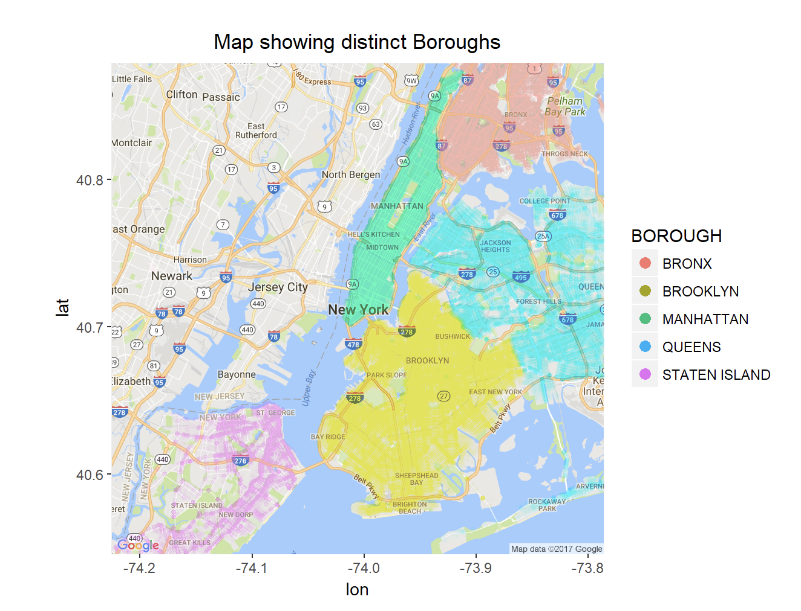
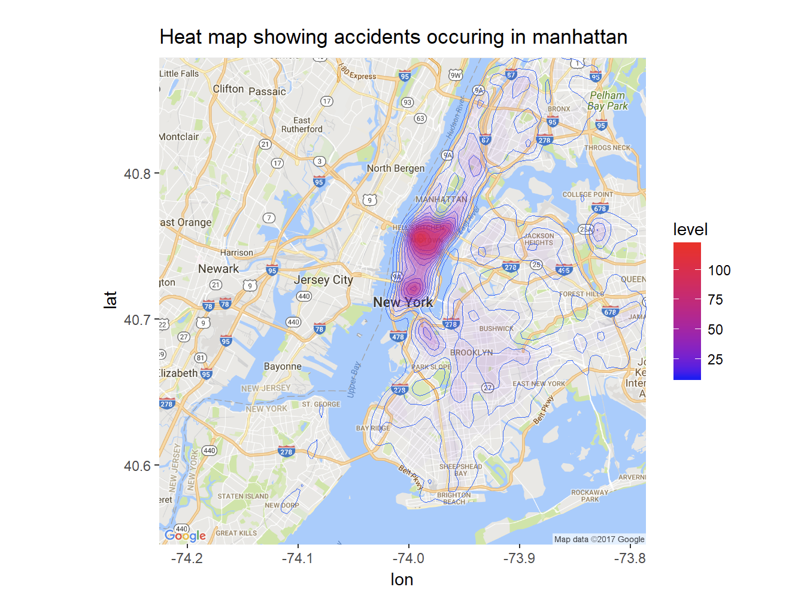
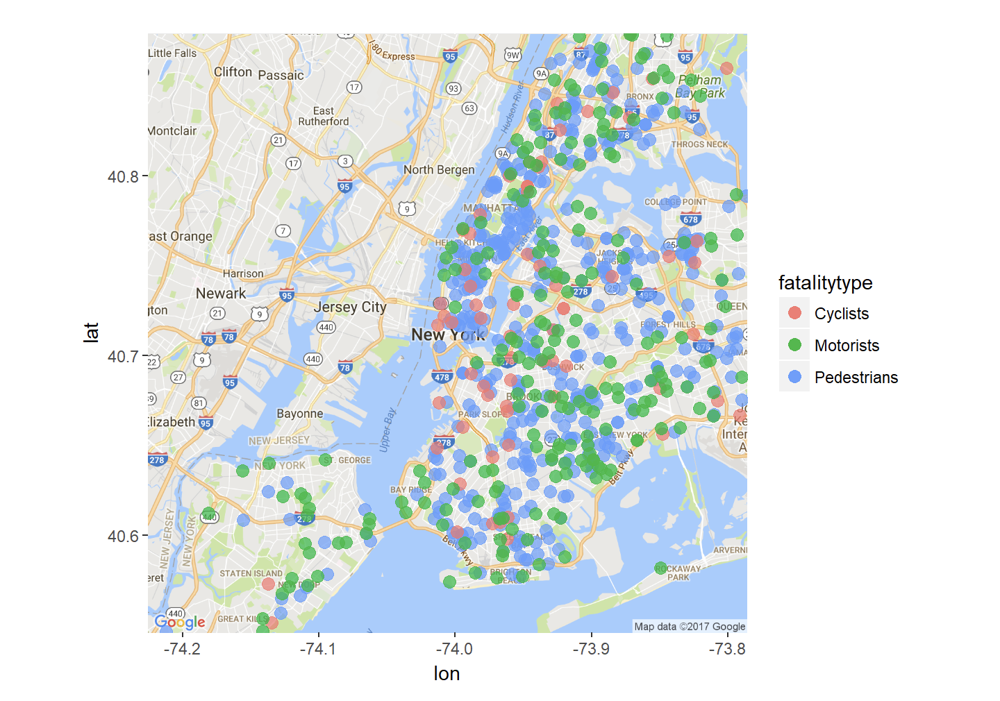
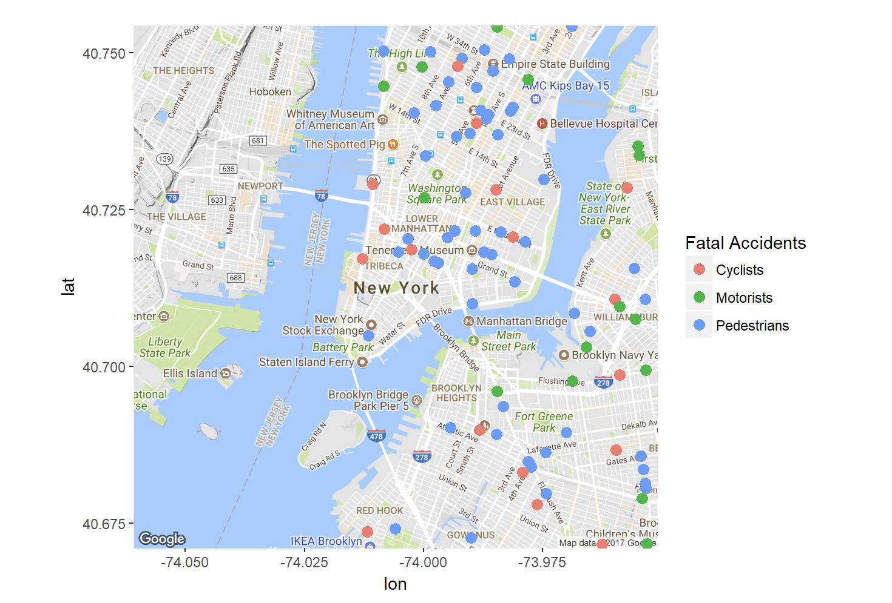

Vehicle collision
================

\#Data Exploration and Analysis

``` r
myMap<-get_map("New York,ny",zoom=11,maptype="roadmap")
```

``` r
vehicle<-vehicle_draft%>%filter(LATITUDE>39 & LATITUDE<45 & LONGITUDE>"-70" & LONGITUDE<"-75")
vehicle<-vehicle%>%filter(BOROUGH!="")
vehicle<-vehicle%>%filter(!is.na(BOROUGH))

max(vehicle$LATITUDE,na.rm=TRUE)
```

    ## [1] 41.12615

``` r
min(vehicle$LATITUDE,na.rm=TRUE)
```

    ## [1] 40.49895

``` r
max(vehicle$LONGITUDE,na.rm=TRUE)
```

    ## [1] -73.70058

``` r
min(vehicle$LONGITUDE,na.rm=TRUE)
```

    ## [1] -74.25453

We began the project by wanting to create a map that would show all of
the boroughs for anyone who was not familiar with New York. Our dataset
had a lot of NA values and other values for longitude and latitude that
did not make sense so we started by filtering those values out of the
dataset as well as any NA values for boroughs. We then found the max and
min values for latitude and longitude to help us create a map that would
be able to show all of the boroughs. After we found these values we
created our map and found the proper zoom.

``` r
ggmap(myMap) + 
  geom_point(data=vehicle, aes(LONGITUDE, LATITUDE, color = BOROUGH), alpha = .006, size = 1) + 
  guides(color = guide_legend(override.aes = list(alpha = 1, size = 3)))+
  labs(title="Map showing distinct Boroughs")+
  theme(plot.title = element_text(hjust = .5))
```

## Map showing distinct Boroughs

<center>



</center>

We highlighted each borough to clearly show which one was which.

``` r
ggplot(vehicle,aes(as.factor(BOROUGH)))+
  geom_bar(aes(fill=BOROUGH))+
  theme_calc()+
  labs(x="Borough",y="No. of accidents", title="Barplot of no. of accidents \n in each Borough")+
  theme(plot.title = element_text(hjust = .5),legend.position = "none")
```


We then created a bar plot of the number of accidents in each of the
boroughs. We found that Brooklyn has the highest number of accidents,
Manhattan and Queens are very similar in amount, while The Bronx and
Staten Island only have about half and a quarter respectively of
accidents that Manhattan has.

``` r
ggmap(myMap)+
  geom_density2d(data=vehicle, aes(x=LONGITUDE,y=LATITUDE), size=.3)+
  stat_density2d(data = vehicle, aes(x=LONGITUDE, y=LATITUDE, fill=..level.., alpha=..level..), size=0.01, bins=16, 
                 geom="polygon") +
  scale_fill_gradient(low = "blue", high="red")+
  scale_alpha(range = c(0,0.3),guide=FALSE)+
  labs(title="Heat map showing accidents occuring in manhattan")
```

## Heat map showing accidents occuring in manhattan

<center>



</center>

We created a heatmap of the number of accidents occurring across the
boroughs. We found that although Brooklyn has the highest number of
accidents occuring, the accidents in Manhattan were much more condensed
into one area. Accidents that occured in Brooklyn and Queens were much
more spread out. The map also helps confirm that Staten Island has the
least amount of accidents since there is almost no markation from the
heat map in that area.

``` r
vehicle <- vehicle%>%
  mutate(hour = hour(hm(TIME)))

ggplot(vehicle, aes(as.numeric(hour)))+
  geom_bar(fill="aquamarine4",col="black")+
  theme_calc()+
  facet_wrap(~BOROUGH)+
  labs(x='Hour of day',y='no. of accidents',title='barplot of no. of accidents at each hour of the day')+
  theme(plot.title = element_text(hjust = .5))
```


We wanted to find out what part of the day the highest number of
accidents occur for each borough, so we created a bar plot that shows
the number of accidents that occur each hour and we facet wrapped the
graph to show each of the boroughs. We had hypothesised that there would
be more accidents in the early morning and at night since it is more
likely that people would be distracted at night, or drunk driving. We
found that for each borough the trend was pretty much the same, the most
accidents occurred during the span of hours 13:00-17:00 or 1:00pm - 5:00
pm. This showed what we thought was incorrect and that more accidents
occur during the early evening rush than at night.

``` r
vehicle <- vehicle%>%
  mutate(killed = ifelse(NUMBER.OF.PERSONS.KILLED > 0 | 
                                      NUMBER.OF.PEDESTRIANS.KILLED > 0 | 
                                      NUMBER.OF.CYCLIST.KILLED > 0 |
                                      NUMBER.OF.MOTORIST.KILLED > 0, 1, 0), 
         numkilled = ifelse(killed == 1, 
                        as.numeric(NUMBER.OF.PERSONS.KILLED) + 
                        as.numeric(NUMBER.OF.CYCLIST.KILLED) +
                        as.numeric(NUMBER.OF.PEDESTRIANS.KILLED) +
                        as.numeric(NUMBER.OF.MOTORIST.KILLED), 0),
         injured = ifelse(NUMBER.OF.PERSONS.INJURED > 0 | 
                        NUMBER.OF.PEDESTRIANS.INJURED > 0 | 
                        NUMBER.OF.CYCLIST.INJURED > 0 |
                        NUMBER.OF.MOTORIST.INJURED > 0, 1, 0),
         numinjured = ifelse(injured == 1, 
                        as.numeric(NUMBER.OF.PERSONS.INJURED) + 
                        as.numeric(NUMBER.OF.CYCLIST.INJURED) +
                        as.numeric(NUMBER.OF.PEDESTRIANS.INJURED) +
                        as.numeric(NUMBER.OF.MOTORIST.INJURED), 0))
```

\#\#Linear Model showing the affect of Borough, hour, and Contributing
factor on the number of people killed in an accident

``` r
model_killed <- lm(data=vehicle, 
            numkilled~as.factor(BOROUGH)+hour+CONTRIBUTING.FACTOR.VEHICLE.1)
#summary(model_killed )
stepmodel_killed <- stepAIC(model_killed)
```

    ## Start:  AIC=-4192757
    ## numkilled ~ as.factor(BOROUGH) + hour + CONTRIBUTING.FACTOR.VEHICLE.1
    ## 
    ##                                 Df Sum of Sq    RSS      AIC
    ## <none>                                       4108.2 -4192757
    ## - as.factor(BOROUGH)             4    0.0439 4108.3 -4192757
    ## - hour                           1    0.0464 4108.3 -4192750
    ## - CONTRIBUTING.FACTOR.VEHICLE.1 48    5.8181 4114.0 -4191727

``` r
stepmodel_killed$anova
```

    ## Stepwise Model Path 
    ## Analysis of Deviance Table
    ## 
    ## Initial Model:
    ## numkilled ~ as.factor(BOROUGH) + hour + CONTRIBUTING.FACTOR.VEHICLE.1
    ## 
    ## Final Model:
    ## numkilled ~ as.factor(BOROUGH) + hour + CONTRIBUTING.FACTOR.VEHICLE.1
    ## 
    ## 
    ##   Step Df Deviance Resid. Df Resid. Dev      AIC
    ## 1                     796049   4108.226 -4192757

``` r
model_injured <- lm(data=vehicle, 
            numinjured~CONTRIBUTING.FACTOR.VEHICLE.1+hour)
#summary(model_injured)
stepmodel_injured <- stepAIC(model_injured)
```

    ## Start:  AIC=368994.1
    ## numinjured ~ CONTRIBUTING.FACTOR.VEHICLE.1 + hour
    ## 
    ##                                 Df Sum of Sq     RSS    AIC
    ## <none>                                       1265349 368994
    ## - hour                           1     380.2 1265729 369231
    ## - CONTRIBUTING.FACTOR.VEHICLE.1 48   28244.7 1293594 386473

``` r
stepmodel_injured$anova
```

    ## Stepwise Model Path 
    ## Analysis of Deviance Table
    ## 
    ## Initial Model:
    ## numinjured ~ CONTRIBUTING.FACTOR.VEHICLE.1 + hour
    ## 
    ## Final Model:
    ## numinjured ~ CONTRIBUTING.FACTOR.VEHICLE.1 + hour
    ## 
    ## 
    ##   Step Df Deviance Resid. Df Resid. Dev      AIC
    ## 1                     796053    1265349 368994.1

| Factor                               | P-value  | Intercept |
| ------------------------------------ | -------- | --------- |
| Unsafe Speed                         | 6.35e-06 | 8.134e-03 |
| Traffic Control Disregarded          | \< 2e-16 | 1.811e-02 |
| Tow Hitch Deffective                 | 0.00551  | 2.210e-02 |
| Physical Disability                  | 0.00528  | 3.984e-03 |
| Pedestrian/Bicyclist/Other Confusion | 6.04e-06 | 1.046e-02 |
| Passenger Distraction                | \< 2e-16 | 1.622e-02 |
| Drugs(Illegal)                       | 4.06e-13 | 2.693e-02 |
| Alchol Involvement                   | 0.02923  | 3.185e-03 |

The linear model had an r-squared value of just 0.00137, which is
extremely low. Only 0.1 percent of the variablity in the numkilled
variable is being explained by the factors, Boroughs, and hours
combined. However, the low r-squared value makes sense, since the
r-squared value for any or all factors combined would still be low,
since it is impossible to explain all the causes for a random variable
that can be affected by an n number of factors; factors we might not
even have the data for.

We filtered the linear model to show only the factors that had
statistically significant p-values. We can see that most of the factors
involved are highly dangerous, such as Unsafe speed, Traffic control
diregarded, Drugs, and Alcohol Involvement. However, the ones that stand
out in terns of peculiarity is Pedestrian Confusion and Passenger
distraction. These values, specifically for this city, makes so much
sense, since New York City is a tourist attraction–specially for
foreighners–who who may not know the traffic regulations of new country,
or maybe just distracted by the attractions arround them, leading to an
accident.

We also created a linear regression model for the same factors affecting
the no. of people injured. However, in this case, most of the
contributing factors were statistically significant, which makes sense,
since an accident would usually occur in someone or the other getting
injured, irrespective of the seriousness of the contributing factor.

\#\#Residual plot and histogram testing the normality of data and
whether a linear regression model should be used or not.

``` r
vehicle<-vehicle%>%
  mutate(residual=resid(model_killed))

ggplot(vehicle, aes(hour, residual)) +
  geom_point() +
  stat_smooth(method = "lm") +
  ylim(-0.02,0.02)+
  labs(x="hour", y="Residual", title="Residual Plot Distribution of Residuals vs. hour") +
  theme(plot.title = element_text(hjust = .5))
```


The residual plot shows that the although distribution of points is
linear, the residuals are not evenly distributed around x axis and are
more towards the negative side, suggesting that a non-linear model would
be better to use.

``` r
ggplot(vehicle,aes(residual))+
  geom_histogram(col="white",fill="aquamarine4",binwidth = 0.0005)+
  labs(x="Residual", y="Frequency", title="Histogram of the frequency of residual") +
  xlim(-0.005,0.005)+
  theme(plot.title = element_text(hjust = .5))
```

[](final_project_files/figure-markdown_github/histogram%20of%20residuals-1.png)

Furthermore, The histogram shows that the residuals are completely
skewed to the left, suggesting that the data is not normal. A histogram
of residuals with a larger concentration of values near zero would
suggest a more consistent dataset, and more reliable conclusions.
However, this is definitely not the case in our data. Hence, we would
like to state that our linear models may not be the best models to show
linear regression. We could have transformed the data to make the data
normal, but that is not something we know how to do yet.

## Bar plot of frequency of accidents for different types of accident

``` r
df<-data.frame(PERSONS.INJURED=c(vehicle$NUMBER.OF.PERSONS.INJURED),
               PERSONS.KILLED=c(vehicle$NUMBER.OF.PERSONS.KILLED),
               PEDESTRIANS.INJURED=c(vehicle$NUMBER.OF.PEDESTRIANS.INJURED),
               PEDESTRIANS.KILLED=c(vehicle$NUMBER.OF.PEDESTRIANS.KILLED),
               MOTORIST.INJURED=c(vehicle$NUMBER.OF.MOTORIST.INJURED),
               MOTORIST.KILLED=c(vehicle$NUMBER.OF.MOTORIST.KILLED),
               CYCLIST.INJURED=c(vehicle$NUMBER.OF.CYCLIST.INJURED),
               CYCLIST.KILLED=c(vehicle$NUMBER.OF.CYCLIST.KILLED))

df_long<-df%>%
  gather("fatality",factor_key=TRUE)

total_fatality<-df_long%>%group_by(fatality)%>%
  summarise(total=sum(value))

ggplot(total_fatality,aes(x=fatality,y=total))+
  geom_bar(aes(fill=fatality),stat="identity")+
  theme_calc()+
  theme(axis.text.x=element_text(angle=60,hjust=1))+
  labs(x='fatality type',y="total no. of fatalities",title="Bar plot showing different \n types of accidents")+
  theme(plot.title = element_text(hjust = .5),legend.position = "none")
```


The bar plot corroborates the linear regression models, which had a lot
of factors being statistically significant for injuries, yet only some
statistically significant for killed. We hyopthesised that it
practically makes sense, since any accident would result in atleast a
minor injury of a person, where as death is more unlikely. This bar plot
corroborates that idea. The bar plot also shows us that the category
most affected by an accident is the person/passenger
himself/herself/themselves. They are closely followed by motorists.

## Map showing different fatality types across the map

``` r
killedped=subset(vehicle,NUMBER.OF.PEDESTRIANS.KILLED > 0)
killedcyc=subset(vehicle,NUMBER.OF.CYCLIST.KILLED > 0)
killedmot=subset(vehicle,NUMBER.OF.MOTORIST.KILLED > 0)
```

``` r
ggmap(myMap)+ 
  scale_color_discrete(name = "fatalitytype") +
  geom_point(data=killedped, aes(LONGITUDE, LATITUDE, color = 'Pedestrians'), alpha=0.7, size=3) +
  geom_point(data=killedcyc, aes(LONGITUDE, LATITUDE, color = 'Cyclists'), alpha=0.7, size=3) +
  geom_point(data=killedmot, aes(LONGITUDE, LATITUDE, color = 'Motorists'),alpha=0.7, size=3)
```

<center>



</center>

The distribution of fatality type is quite interesting. We can see that
there is a strong concentration of pedestrian being killed in the
Manhattan region \[see first map for Borough segregation\]. Comparing
this to the first heat map we created, we had seen a significantly
bright red spot in the manhattan region.

\#Zoomed in map for Manhattan

``` r
map_zoomed<-get_map("New York City", zoom=13)

ggmap(map_zoomed)+ 
  scale_color_discrete(name = "Fatal Accidents") +
  geom_point(data=killedped, aes(LONGITUDE, LATITUDE, color = 'Pedestrians'), size=3) +
  geom_point(data=killedcyc, aes(LONGITUDE, LATITUDE, color = 'Cyclists'), size=3) +
  geom_point(data=killedmot, aes(LONGITUDE, LATITUDE, color = 'Motorists'), size=3)
```

<center>



</center>

To get a closer look, we zoomed in on to the Manhattan region. This
clearly shows that pedestrian deaths are more likely in the manhattan
region, specially in the more toursit attraction places such as the
Empire State Bulding region \[top of the map\] and lower Manhattan
\[botton of the Manhattan region\]. Knowing that New York is a tourist
attraction, and people usually walk everythere they go, we hypothesised
that the pedestrian confusion factor would be one of the main reasons
for high number of people getting killed in Manhattan. Since this
hypothesis seems practically significant, we investigated whether it is
statistically significant or not.

\#\#Linear regression for number of people killed in an accident in
Manhattan vs Contributing factors affecting the accident

``` r
manhattan_dat<-vehicle%>%filter(BOROUGH==("MANHATTAN"))

model_manhattan <- lm(data=manhattan_dat, 
            numkilled~CONTRIBUTING.FACTOR.VEHICLE.1)
#summary(model_manhattan)
```

| Factor                               | P-value  | Intercept |
| ------------------------------------ | -------- | --------- |
| Pedestrian/Bicyclist/Other Confusion | 1.84e-10 | 2.494e-02 |
| Passenger Distraction                | 8.2e-05  | 1.005e-02 |

Filtering out the main variables with statistically significant p-values
AND significantly higher values than other variables, we can see that,
as hypothesised, pedestrian confusion had a significant effect on the
number of people killed in Manhattan, along with Passenger distraction.
Their intercept value, although looks small, was larger than other
values by a factor of 10. The visual thaat corroborates this data was
the scatter point map which we used to create this hypothesis. \[showing
high no. of pedestrian deaths in the Manhattan region\]. It is important
to note, that as usual, the r-squared value was extremely low. \[around
0.04 percent variablity in deaths was explained\].

\#\#Logistic Regression

``` r
#Create Training and Test Fraud sets:
killedmod = vehicle[vehicle$killed==1,]
shuffledKilled = killedmod[sample(nrow(killedmod)),]
TrainingKilled = shuffledKilled[1:(nrow(killedmod)/2),]
TestKilled = shuffledKilled[(nrow(killedmod)/2):nrow(killedmod),]

#Create Training and Test Fraud sets:
NonKilled = vehicle[vehicle$killed==0,]
shuffledNonKilled = NonKilled[sample(nrow(NonKilled)),]
TrainingNonKilled = shuffledNonKilled[1:(nrow(NonKilled)/2),]
TestNonKilled = shuffledNonKilled[(nrow(NonKilled)/2):nrow(NonKilled),]

Training = rbind(TrainingKilled,TrainingNonKilled)
Test = rbind(TestKilled,TestNonKilled)


logmodel = glm(killed~as.factor(CONTRIBUTING.FACTOR.VEHICLE.1),family=binomial('logit'),Training)

prediction = predict(logmodel,Test,type='response')
roccurve <- roc(Test$killed ~ prediction)
plot(roccurve)
```


``` r
auc(Test$killed, prediction)
```

    ## Area under the curve: 0.6641

A logistic regression takes the parameters that are plugged into it and
determines the likelihood of something happening based on the paremeters
being input. The above graph shows how the logsitic regression has an
area under the curve of around 0.65 which means that the logistic
regression is not as accurate as we would like however due to the nature
of the data being looked at the regression is able to account for a
decent amount of the data.

``` r
k = 10
results = rep(0,k)
for (i in(1:k)){
  #Define indices
  TestKilledIndices = ((i-1)*floor(nrow(shuffledKilled)/k)+1) : (i*floor(nrow(shuffledKilled)/k))
  TestNonKilledIndices = ((i-1)*floor(nrow(shuffledNonKilled)/k)+1) : (i*floor(nrow(shuffledNonKilled)/k))
  
  #Create training and test Populars and NonPopulars
  TestKilleds = shuffledKilled[TestKilledIndices,]
  TrainingKilleds = shuffledKilled[-TestKilledIndices,]
  
  TestNonKilleds = shuffledNonKilled[TestNonKilledIndices,]
  TrainingNonKilleds = shuffledNonKilled[-TestNonKilledIndices,]
  
  Training = rbind(TrainingKilleds,TrainingNonKilleds)
  Test = rbind(TestKilleds,TestNonKilleds)
  
  #Create Model on Training Data:
  KillModel = glm(killed~as.factor(CONTRIBUTING.FACTOR.VEHICLE.1),family=binomial('logit'),Training)
  summary(KillModel)
  
  #Evaluate on Test Data:
  Killed_predictions = predict(KillModel,Test,type='response')
  
  results[i] = auc(Test$killed, Killed_predictions)
}

mean(results)
```

    ## [1] 0.6550807

``` r
logit2prob <- function(logit){
  odds <- exp(logit)
  prob <- odds / (1 + odds)
  return(prob)
}

value <- logit2prob(coef(logmodel))
```

The above values show the mean of the multiple runs that were made on
the data to find the most accurate result for the auc. In the logistic
regression that was run some of the variables that were significant were
Drugs (illegal), Passenger distraction, and Traffic control disregarded.
The table below provides the probability of each of these significant
factors and their p-values. These values are also the most likely to
result in a fatality and the NYPD would want to watch out for when these
colisions might occur.

| Factor                      | P-value  | Probability |
| --------------------------- | -------- | ----------- |
| Drugs (illegal)             | 5.23e-05 | 0.975       |
| Passenger Distraction       | 4.56e-05 | 0.945       |
| Traffic Control Disregarded | 4.41e-05 | 0.942       |

The above table does not necessarily cover all of the significant values
as due to some randomization of the data for testing the model and some
of the values fluctuate. However, even with the fluctuations in the
model the

\#Summary

The data provided by the New York City police department about the
traffic collisions in New York City has proved that there are a lot of
different factors that might lead to a collision. However, according to
the analysis that we have completed in this paper there are certain
factors that are more likely to cause a fatal accident or cause
injuries. These factors include but are not limited to the use of
illegal drugs while driving, a passenger distracting the driver, and the
traffic control being disregarded.

Another couple of other important factors are where and when the
collisions occur which could help the NYPD determine where they might
want to place officers to keep the drivers and pedestrians on their best
behaviour. Manhattan has the highest concentration of collisions but not
the highest number of recorded collisions which would go to the borough
of Brooklyn. Originally the group thought that there would be more
collisions in the early morning due to the higher chance of drunk
driving and people being really tired but on the contrary the time when
there is the highest number of incidents is during the early afternoon
and rush hour.

There are a few limitations to our model as we were unable to separate
the contributing factors to do a more direct analysis of each of the
different reasons for the accidents. A way to combat this in the future
would be to create a set of super categories that combine different
groups of factors that are similar such as traffic control, distraction,
pedestrian, and other similar categories that would determine the more
general factors that lead to the collisions. With more analysis there is
a lot of information that could help groups like the NYPD to learn more
about how they might inform the public to try and prevent fatal
collisions.
